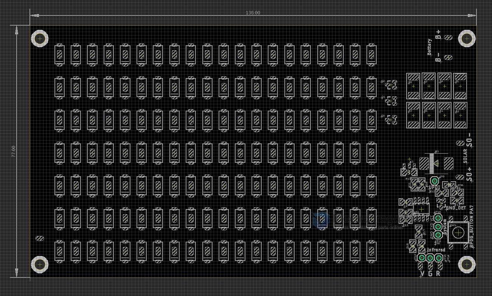

# ILE1073-dat

- legacy wiki page - https://w.electrodragon.com/w/HP25_LED_Panel

[High Power Interactive LED Panel 25W](https://www.electrodragon.com/product/high-power-interactive-led-panel-25w/)

- software - [[megatinycore-dat]]

## hardware 

- [[led-dat]] - [[tinyAVR-dat]]

power supply - [[li-battery-dat]] 4.2V 

## Pin Definitions 

board == - [] ATtiny412/402/212/202

SOP 8 

|     |      | arduino | index | left | right | index | arduino |      |          |
| --- | ---- | ------- | ----- | ---- | ----- | ----- | ------- | ---- | -------- |
|     |      |         | 1     | VCC  | GND   | 8     |         |      |          |
| IR  | TXD0 | 0       | 2     | PA6  | PA3   | 7     | 4       |      | LED_CTRL |
| BTN | RXD0 | 1       | 3     | PA7  | PA0   | 6     | 5       | UPDI |          |
| TXD | TXD2 | 2       | 4     | PA1  | PA2   | 5     | 3       | RXD2 | GND_DET  |

Solar Panel Input = un-regulated higher DC input
- SO+
- SO-

[[Infrared-dat]] Control
- V = VCC
- G = GND
- R = Infrared input 

[[Battery-dat]] In  
- B+ = LED+
- B- = GND

Other Pins 
- TXD/VCC/GND - debug only 
- UPDI - flash chip 

## Power Supply 

- SO+ via diode to B+/LED+
- B+/LED+ via LDO to system VCC

## LED Drive

- On low side mosfet 

## Chip Pin Definitions 

- [[ainyAVR-dat]] 0-series

## Demo 

- https://www.electrodragon.com/w/Demo_Video

- demo code - https://github.com/Edragon/Arduino-attiny

- [[arduino-dat]]

## ref 

- [[ILE1073]]