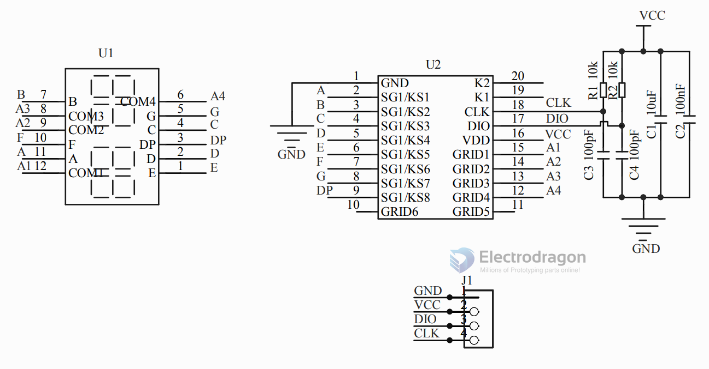

# IMS1002-dat

- [[I2C-dat]]

## SCH 

## Features :

This module is a 12-pin 4-bit common anode digital tube (0.36 inch) display module with clock points. The driver chip is TM1637. Only 2 signal lines are needed to enable the microcontroller to control the 4-bit 8-segment digital tube.

The module features are as follows:

- The display device is a 4-digit common positive red digital tube
- Digital tube with 8 levels of grayscale adjustable
- The control interface level can be 5V or 3.3V
- 4 M2 screw positioning holes for easy installation

Control interface: a total of 4 pins (GND, VCC, DIO, CLK), GND is the ground, VCC is the power supply, DIO is the data input and output pin, and CLK is the clock signal pin;

Digital tube: 4-digit 0.36-inch digital tube with common anode and score point, red letters highlighted;

Positioning holes: 4 M2 screw positioning holes with a hole diameter of 2.2mm, making the module easy to install and position, and realizing combination between modules;

## wiring

| arduino | connecting cable | 4-digit digital tube display module |
| ------- | ---------------- | ----------------------------------- |
| GND     | black line       | GND                                 |
| 5V      | red line         | VCC                                 |
| D2      | yellow line      | DIO                                 |
| D3      | white line       | CLK                                 |

## ref

- [[display-header-dat]]

- classic arduino library DigitalTubeforArduino 1.0+ --- [[DigitalTubeforArduino1.0+.rar]]
- or search [[TM1637-dat]] in arduino IDE

- [[IMS1002]]
