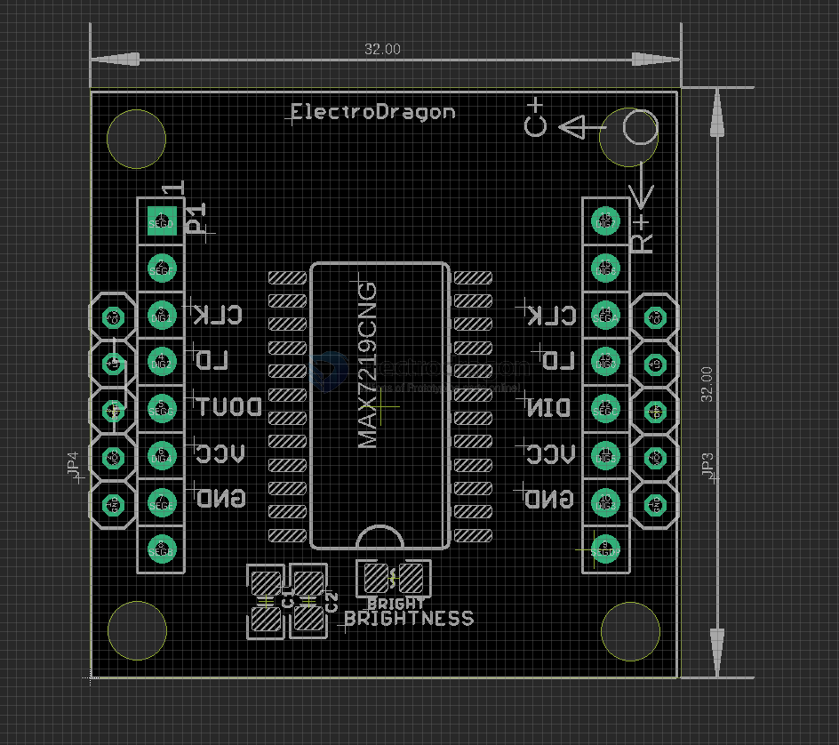

# IMS1009-dat 

- https://w.electrodragon.com/w/Parola

## Uni Map 

- chain from top-side right to left 
- Pin Definitions: CLK / LD / DIN / VCC / GND

## Kit BOM 

| Item                                   | qty.   | usage                                                         |
| -------------------------------------- | ------ | ------------------------------------------------------------- |
| PCB x3                                 | x1     | pre-connected (chained) 3x PCB                                |
| 8x8 Dot LED   matrix  super bright RED | x3     | main display parts                                            |
| 5pcs jumpers                           | x5     | connect to the next chain                                     |
| 1*5 bended and 1*5 straight pin header | x1, x1 | connect to the next chain                                     |
| 3pcs 1*20 socket pin headers           | x3     | please break them into 6pcs 1*8 pin header for dot led matrix |

## ref 

- [[IMS1009-fab]]