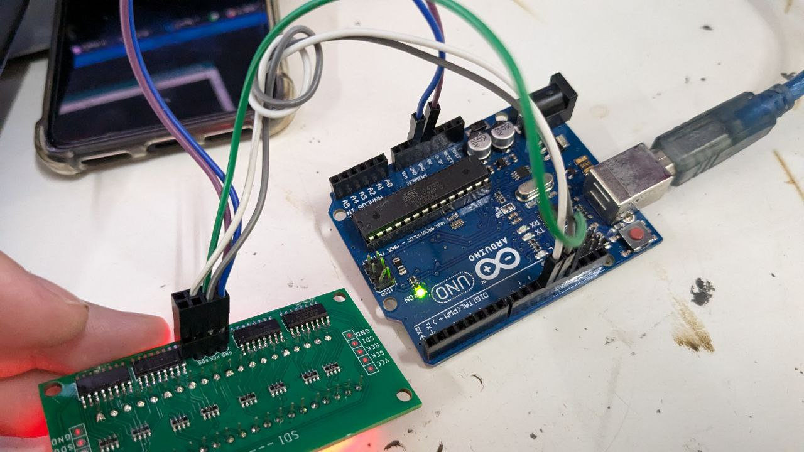

# IMS1030-dat

- legacy wiki page - https://w.electrodragon.com/w/74HC595_Segment_Display

## demo code 

at https://github.com/Edragon/arduino-main2/tree/main/IMS/IMS1030-seg_display-74HC595

    int clockPin = 13;   // connect to CLK pin
    int latchPin = 12;   // connect to LCK or RCK pin
    int dataPin = 11;    // connect to SDI pin

and extra VCC and GND power supply pins 

## demo 

https://www.youtube.com/shorts/wiDk-X6urJ4

## ref 

- [[74HC595-dat]] - [[74xx-dat]]

- [[IMS1030]]