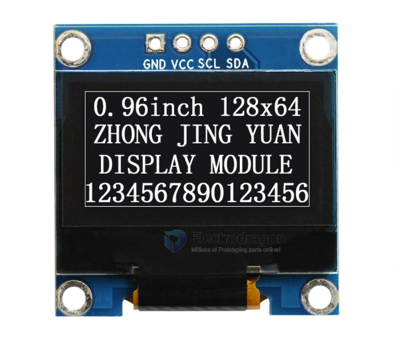

# IOD1001-dat 

## Pins:
- GND
- VCC
- SCL
- SDA

## Features 
- Voltage: 3.3V
- Chip: SSD1306 

## address 

- 0x78 = 0x3C (default resistor set)
- 0x7A = 0x3D

## demo video 

- https://www.youtube.com/watch?v=-S0XRB664-M&feature=youtu.be

## ref 

- [[IOD1001-dat]] - [[IOD1003-dat]]

- [[I2C-dat]] - [[OLED-dat]]