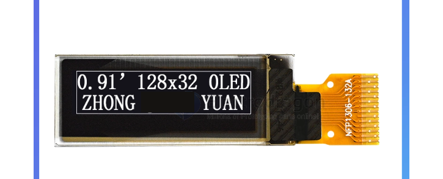
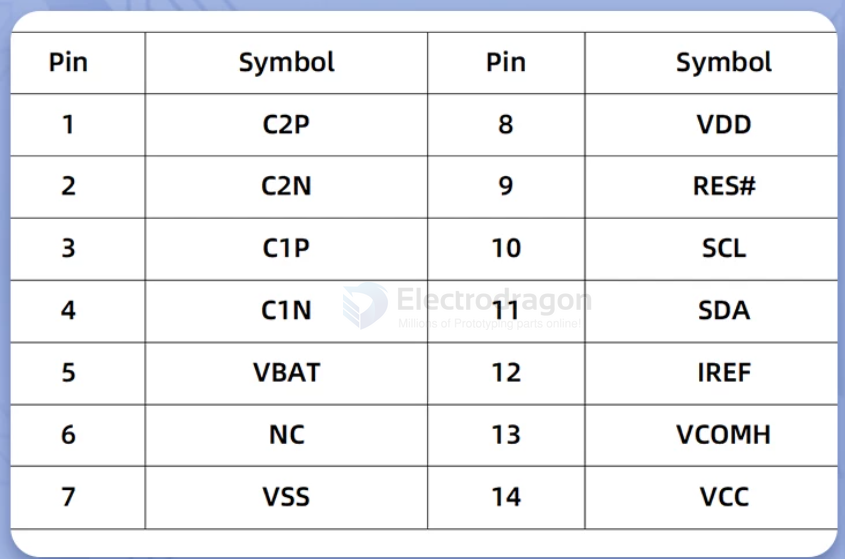
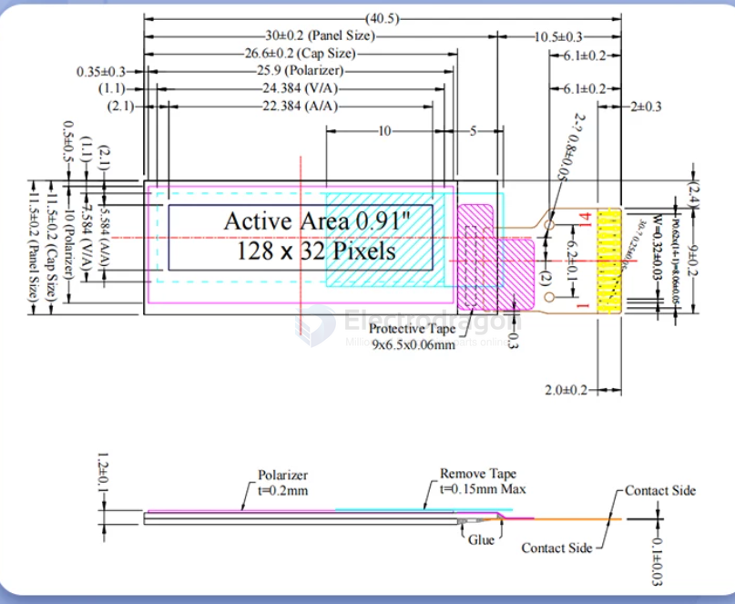

# IOD1011-dat

- [[OLED-raw-0.91-dat]] - [[IOD1011-dat]]

## Info

[product url - Raw Small Size OLED Display FPC [Size]](https://www.electrodragon.com/product/raw-oled-display-size/)

### Board Map, Dimension, Pins, chip info, Use Guide, Setup Jumper, etc.

- 尺寸 0.91英寸 PM OLED
- 分辨率 128*32
- 接口类型 SPI接口
- 控制芯片 SSD1306
- 显示颜色 白色、黄色、蓝色
- 显示区域 22.384 x 5.584(mm) 
- 面板尺寸 30 x 11.5 x 1.2(mm)
- 像素大小 0.159 x 0.159(mm)
- 像素间距 0.175 x 0.175(mm)
- 管教数量 15pin焊接式 为0.62mm间距
- 视角方向 全视角
- 工作电压 3.3V
- 工作温度 -40~70℃

dimension 

## Applications, category, tags, etc. 

## Demo Code and Video

## ref 

- [[OLED-dat]] - [[OLED]]

- [[IOD1011]]