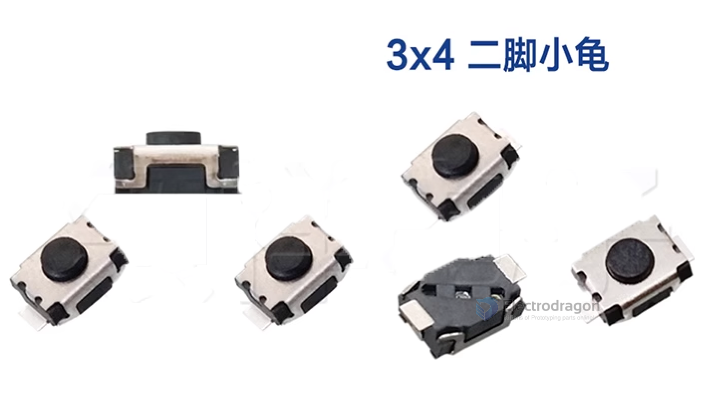
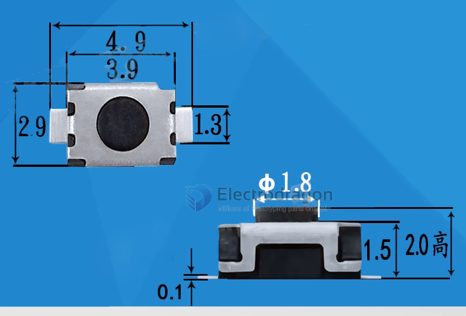

# ISB1016-dat 

4.9 x 2.9 x 2

TS-1088-AR02016

- 4*3*2mm 立贴 轻触开关
- 描述 贴片无柱轻触开关
- 品牌名称 XUNPU(讯普)
- 商品型号 TS-1088-AR02016
- 商品编号 C720477
- 商品封装 SMD
- 包装方式 编带
- 商品毛重 0.121克(g)

https://www.lcsc.com/product-detail/Tactile-Switches_XUNPU-TS-1088-AR02016_C720477.html

## ref 

- [[button-dat]]

- [[ISB1016]]