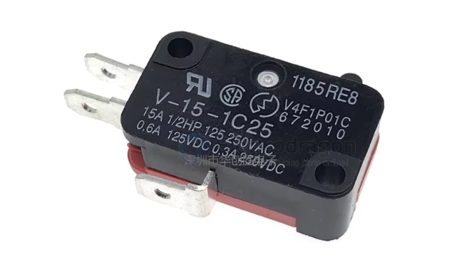
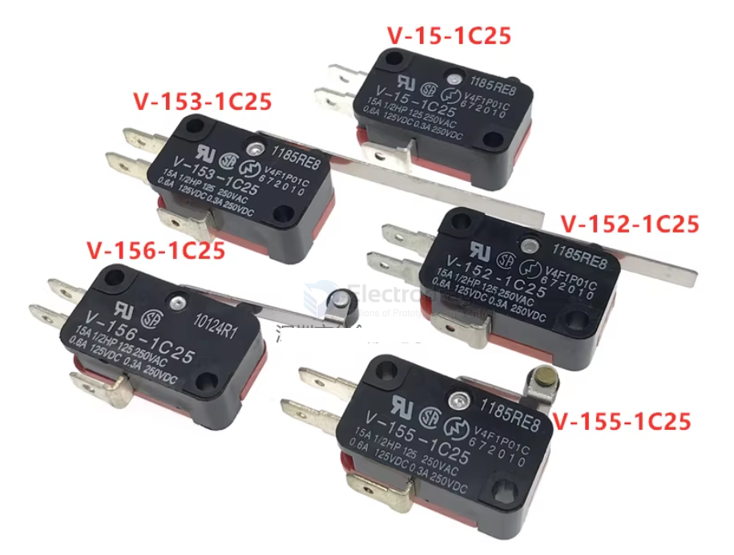

# ISB1030-dat

- [[switch-limit-dat]]

## Info

[product url - Omron V-152-1C25 Limit Switch](https://www.electrodragon.com/product/spdt-micro-limit-sensor-openclose-switch/)

### Board Map, Dimension, Pins, chip info, Use Guide, Setup Jumper, etc.

Rated: 0.6A/ 125V; 3A/250V

all specs 

## Applications, category, tags, etc. 

## Demo Code and Video

## ref 

- [[ISB1030]] - [[ISB]]

- legacy wiki page 

