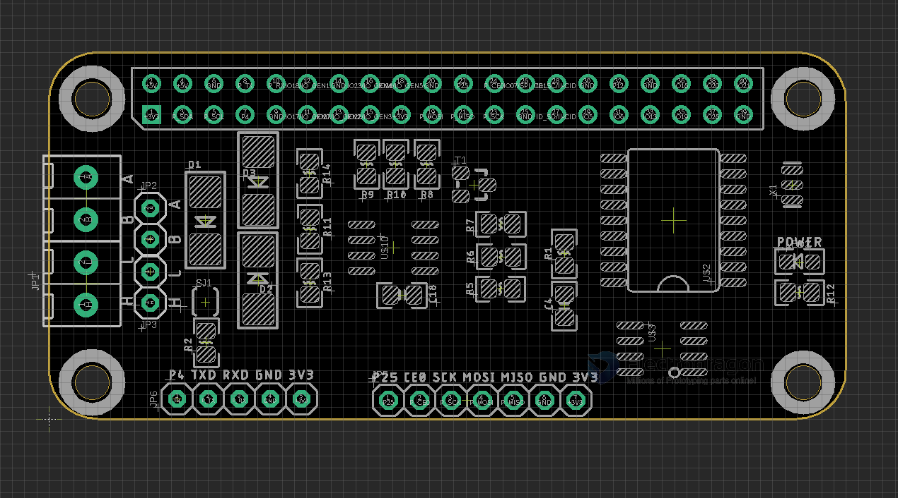

# ITF1000-dat 

[Raspberry Pi RS-485, CAN Shield](https://www.electrodragon.com/product/raspberry-pi-rs-485-can-shield/)

## Board Map 

### Functions 

[[RS485-dat]] - On board Chips - from TXD0 and RXD0 to [[MAX3485-dat]]

SPI to CAN - [[MCP2515-dat]]

## ref 

- [[RS485-dat]] - [[can-dat]] - [[RPI-dat]]

- [[ITF1000]]