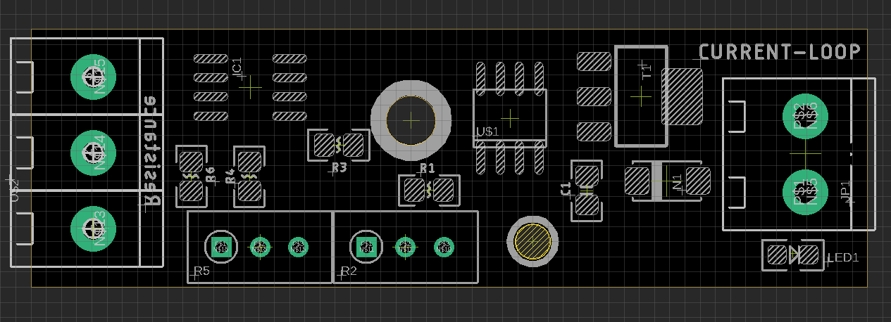
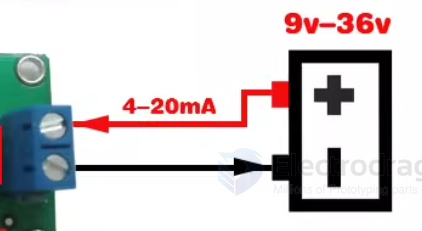
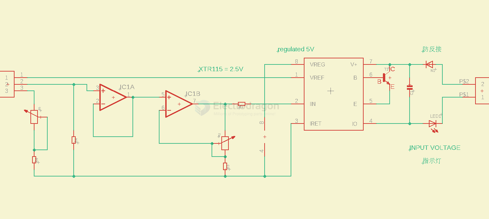

# ITF1003-DAT

- [[industrial-measurement-dat]]

- [[resistance-dat]] - [[current-dat]]

- tune R5 for minimium current loop value to 4 mA
- ture R2 for maxmium current loop value to 20 mA

check LED brightness to get visual feedback of the current

DC 9-36V input

read current value on the right side 

## Tune Calibration V2

- prepare a trim pot, tune to maximium level, for example a 1K trim pot, one side 0R, another side 1K
- please follow the step below 
- a current meter is helpful to check the right side output current 

| step  | POT        | action on  | taget resistor input | target to get | AMP.level |
| ----- | ---------- | ---------- | -------------------- | ------------- | --------- |
| first | R2 (right) | RIGHT turn | min.                 | 20 mA         | second    |
| then  | R5 (left)  | LEFT turn  | max.                 | 4  mA         | first     |

- now you can tune the input resistance to check output current 
- notice active input resistance are the middle and bottom pins (left side terminal)

output test - disconnect the power supply and test current by [[multimeter-dat]]

## SCH 

voltage input from the right side 9~36V, and measure current on the right side too 

pin 4~7 == current output 

## demos 

- https://twitter.com/electro_phoenix/status/1651909594900467712 

## ref 

- [[XTR115-dat]] - [[LM358-dat]] - [[TI-dat]]

- [[resistor-dat]]

- [[ITF1003]]

- [[XTR115]] - [[XTR116]]

