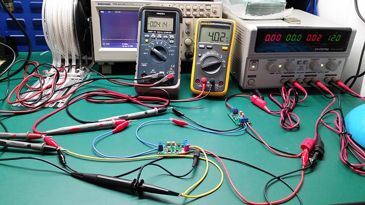

# ITF1006-DAT

## Pins 

- Two-pin to target-read
- Three-pin board power supply, middle pin output voltage-read

## Use Guide 

### two pin load wiring 

#### Single Power Supply 
- All input power from three-pin terminal VCC GND pins 
- yellow pin for output voltage read
- module power supply 7-30V, 2V higher than output-side

#### seperated Power Supply 
- Further add power supply on two-pin measure-target side 

### three pin load wiring

### Tuning Steps 
- Set input current to 4mA,  tune 10K  trim-pot, until output voltage to 0V
- Set input current to 20mA, tune 100K trim-pot, until output voltage to 5V
- Done 

A simulation trim-pot can be used as a target load on left side 

### Tests 

## ref 

- https://t.me/electrodragon3/237
- https://t.me/electrodragon3/178
- https://www.electrodragon.com/product/current-loop-to-analog-voltage-converter-4-20ma-to-0-5v/
