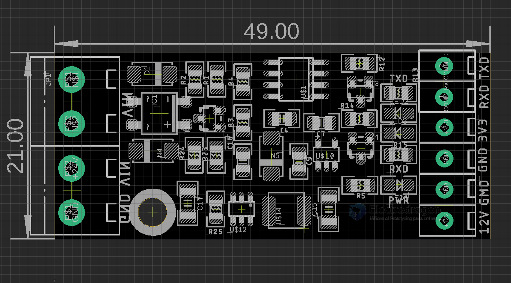

# ITF1009-dat

- left top terminal - no direction power input 
- left bottom terminal - 24V - GND
- right top terminal - serial input and output 
- right middle terminal - 3.3V - GND on board regulator output 
- right bottom terminal - 12V - GND on board DCDC switcher output  

- based on option 401: [[DCDC-dat]] 

- based on option 231: [[LDO-dat]]