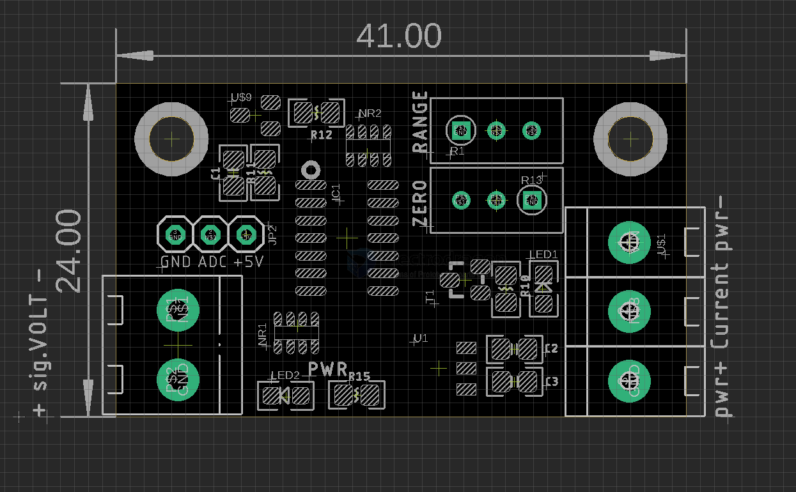
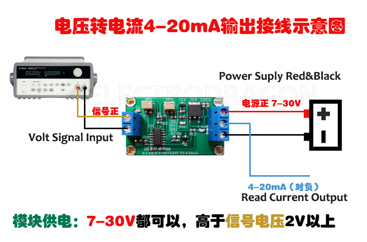

# ITF1012 DAT 

- [[industrial-measurement-dat]]

## Info

[product url - ADC Analog Read Value 0~5V to 5~20mA Current-Loop Transmitter Converter](https://www.electrodragon.com/product/adc-analog-read-value-05v-to-520ma-current-loop-transmitter-converter/)

### Board Map, Dimension, Pins, chip info, Use Guide, Setup Jumper, etc.

input signal voltage on the left, power supply and output current on the right

#### Pins 

- [[LM324-dat]] - [[LM358-dat]]

- [[voltage-reference-dat]]

#### tuning methods 

Adjustment method: 

- Input 0V, adjust the `zero` potentiometer to 4mA 
- Input the target voltage, adjust the `range` potentiometer to 20mA

#### customized support input signal range

- 0-2.5V to 4-20mA
- 0-3.3V to 4-20mA
- 0- 5 V to 4-20mA
- 0- 10V to 4-20mA
- 0- 15V to 4-20mA
- 0- 24V to 4-20mA

## Applications, category, tags, etc. 

## Demo Code and Video

## ref 

- [[ITF1012]]

- legacy wiki page 

