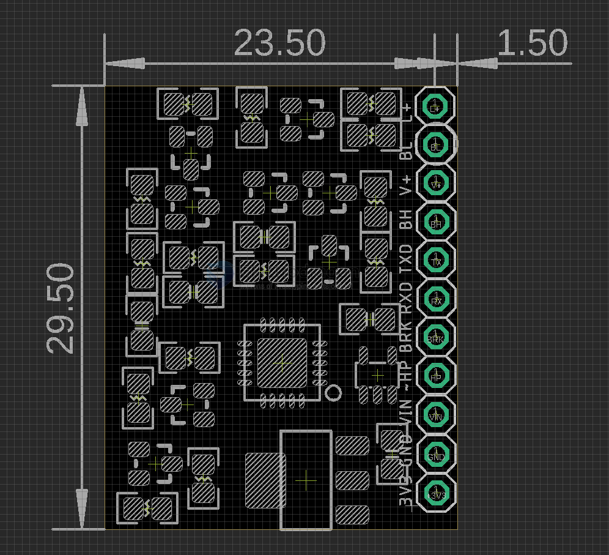

# ITF1014-dat

## board dimension 

## Pin Definitions 

| index | pin | Function                      | mode             |
| ----- | --- | ----------------------------- | ---------------- |
| 1     | L+  | pair with - bus control pin L |                  |
| 2     | BL  | bus control pin L             |                  |
| 3     | V+  | pair with - bus control pin H |                  |
| 4     | BH  | bus control pin H             |                  |
| 5     | TX  | data                          | direct from chip |
| 6     | RX  | data                          | direct from chip |
| 7     | BRK | error indicator               | direct from chip |
| 8     | HP  | baudrate select               | direct from chip |
| 9     | VIN | chip Power supply in          |                  |
| 10    | GND | chip Power supply gnd         |                  |
| 11    | 3V3 | LDO regulated OUT             |                  |

- pin 8 keep float for 9600 bps

## ref 

- [[powerbus-dat]]

- [[ITF1014]]