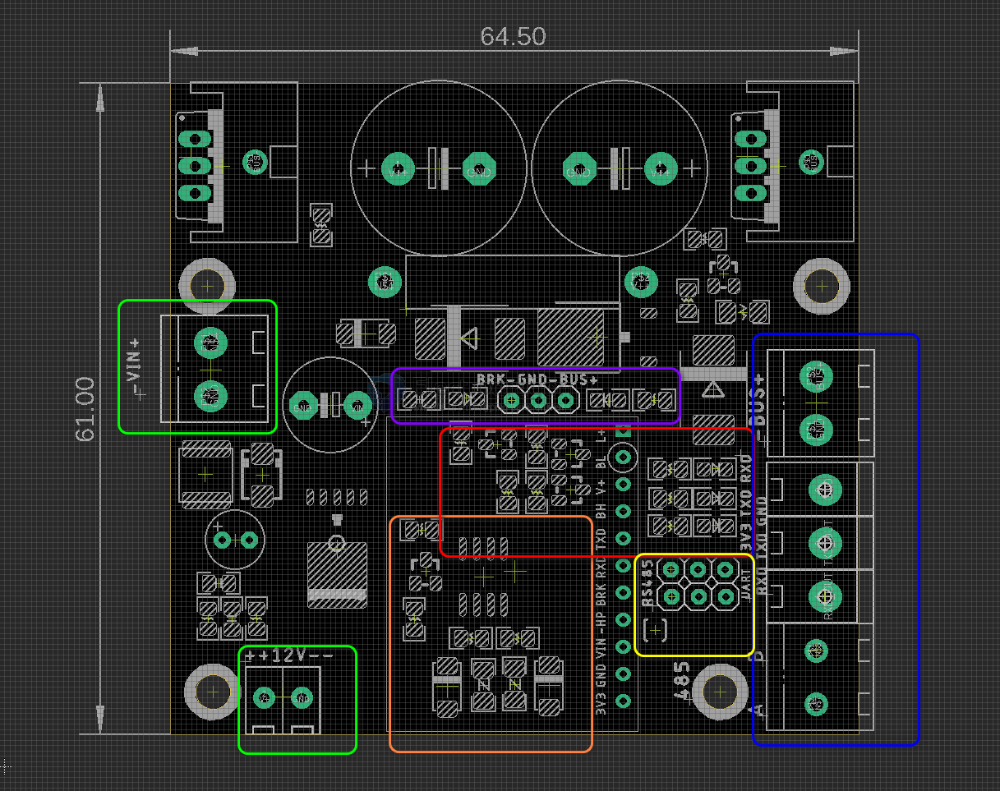

# ITF1015-dat

## Board map 

Green box 
- power bus power in 
- 12V by on board regulator, supply for chip, can also be used by other your purpose

Orange box 
- RS485 converter 

Yellow box
- direct TTL output or RS485 output selector 

Red box 
- Data indicator 
- 3V3 power indicator 

Purple box
- NC, not in use

Blue box
- All data output
- BUS output to slave modules 
- TTL data output 
- RS485 data output 

## ref 

- [[powerbus-dat]]
