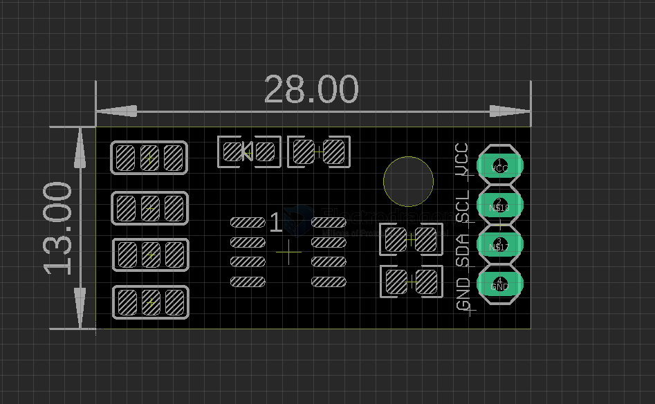

# MOT1005-dat

## Info

[product url - AT24C256 (256Kb) EEPROM Data Module (I2C Bus)](https://www.electrodragon.com/product/at24c256-256kb-eeprom-data-module-i2c-bus/)

### Board Map, Dimension, Pins, chip info, Use Guide, Setup Jumper, etc.

dimension 

- [[EEPROM-dat]] - [[I2C-dat]]

## Applications, category, tags, etc. 

## Demo Code and Video

## ref 

- [[MOT1005]] 

- legacy wiki page 
