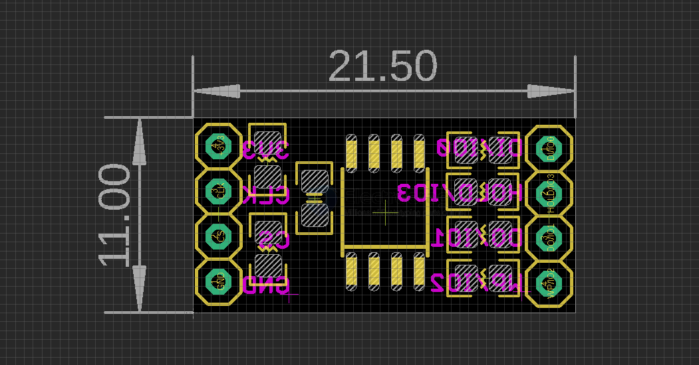

# MOT1020-dat

## Info

[product url - SPI Flash Breakout Board, WinBond W25Q64FVSSIG 64M-bit](https://www.electrodragon.com/product/spi-flash-breakout-board-winbond-w25q64fvssig-64m-bit/)

### Board Map, Dimension, Pins, chip info, Use Guide, Setup Jumper, etc.

- [[memory-dat]] - [[spi-flash-dat]]

schematic in - [[spi-flash-dat]] general use 

## Applications, category, tags, etc. 

## Demo Code and Video

## ref 

- [[MOT1020]] 

- legacy wiki page 
