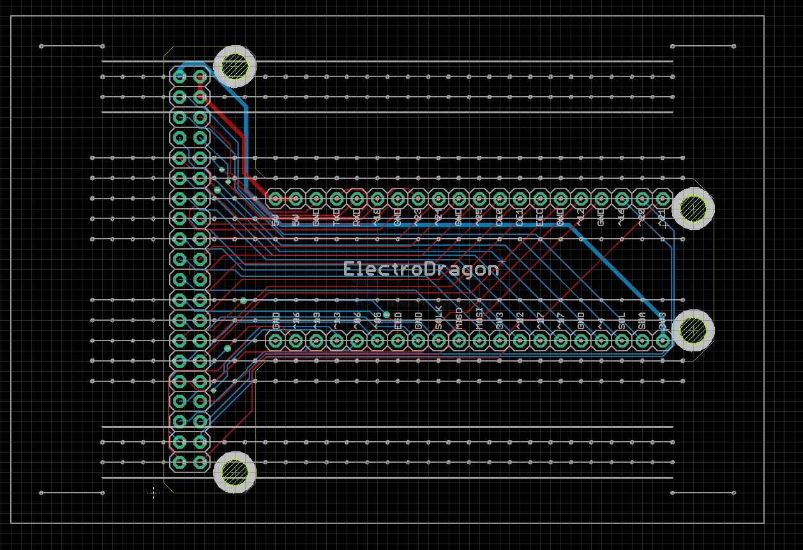
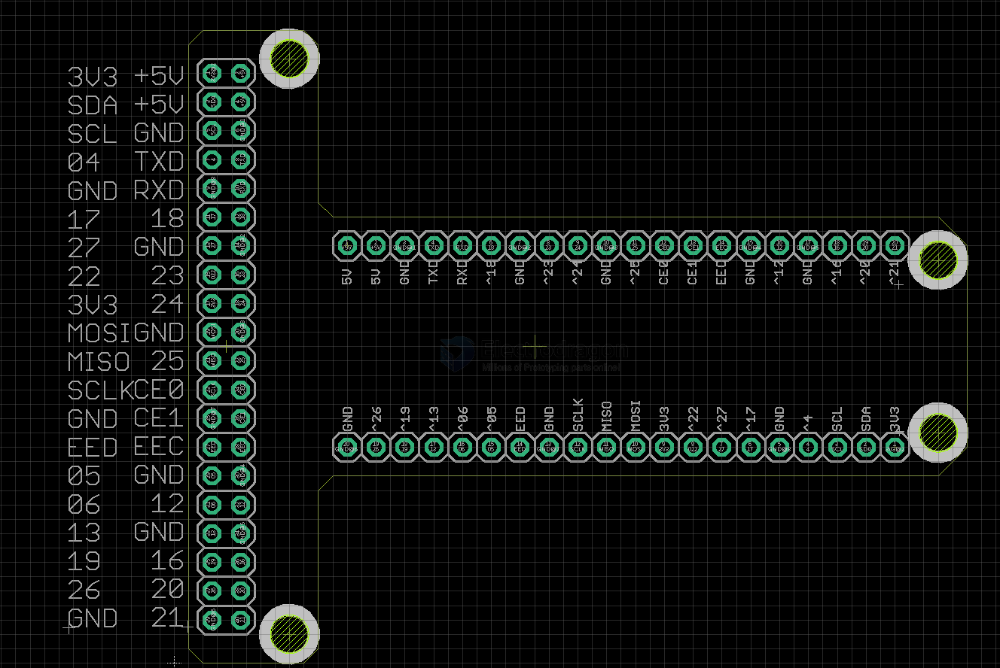
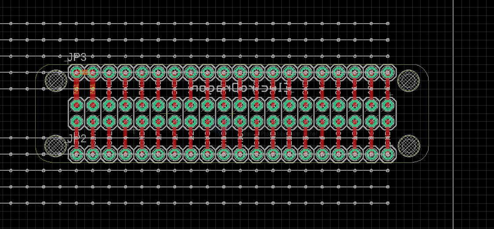

# MPC1033-dat

- [[RPI-SBC-dat]] - [[RPI-pin-dat]] 

[Raspberry Pi 2 40P Breakout Board Kit](https://www.electrodragon.com/product/raspberry-pi-2-40p-breakout-board-kit/)

design for [[RPI-SBC-dat]] series 40-pin 

cable use - [[cable-ribbon-dat]] - [[PCA1009-dat]] - [[PCA1011-dat]] - [[PCA1012-dat]]

## version V2 

board A and B both included 

board == A 

pin definitions 

board == B

## PIns 

- GND
- ^26
- ^19
- ^13
- ^06
- ^05
- EED
- GND
- SCLK
- MISO
- MOSI
- 3V3
- ^22
- ^27
- ^17
- GND
- ^4
- SCL
- SDA
- 3V3

## ref 

- [[RPI3-dat]]