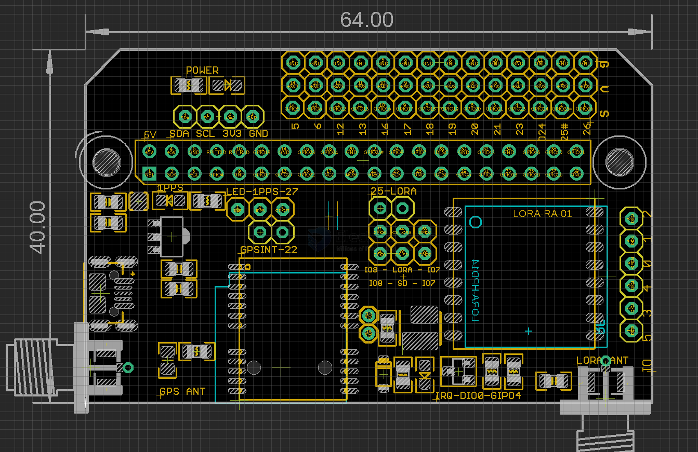
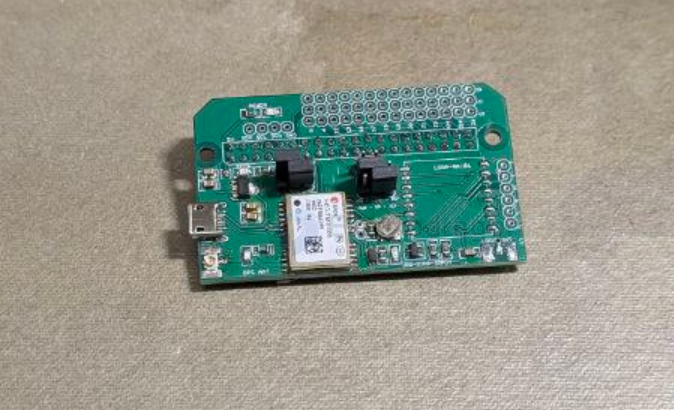
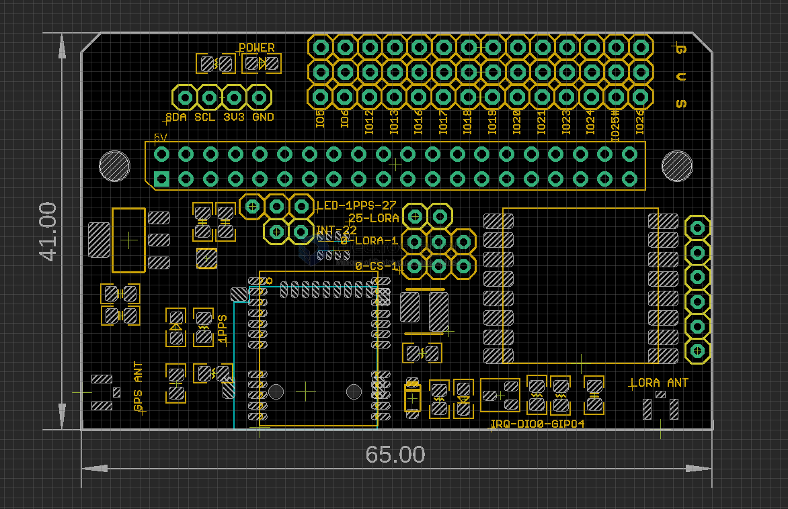

# MPC1056-dat

https://www.electrodragon.com/product/gps-addon-shield-for-raspberry-pi-b2/

legacy wiki page - https://www.electrodragon.com/w/GPS_Addon_Shield_for_Raspberry_Pi_B2

lora legacy wiki page https://www.electrodragon.com/w/SX1278#Lora_Shield_for_RPI

## tech 

- [[GPS-dat]] - [[location-dat]] 

- [[NEO-6-dat]] - [[NEO-7-dat]] - [[NEO-8-dat]] - [[u-blox-dat]]

- [[location-dat]] - [[GNSS-dat]] - [[serial-CMD-dat]]

- [[SX1278-dat]] - [[lora-dat]] - [[SPI-CMD-dat]]

- [[SD-dat]]

- [[location-dat]] - [[GNSS-dat]] - [[GPS-dat]] - [[nema-dat]]

- [[antenna-GNSS-dat]] - [[CONN-SMA-dat]] - [[CONN-IPEX-dat]]

- [[antenna-dat]] - [[3in1-antenna-dat]] == default connector for [[GNSS-dat]] is - [[CONN-IPEX-dat]]

- [[RPI-SBC-dat]] - [[RPI-SDK-dat]] - [[SPI-CMD-dat]] - [[serial-CMD-dat]]

- [[RPI-HDK-dat]]

- [[LED-dat]]

## default pin setup 

| Function   | Pin             | alternatives | Description                     |
| ---------- | --------------- | ------------ | ------------------------------- |
| 1PPS       | LED             | IO7          |                                 |
| GPS_INT    | 22              |              |                                 |
| SD_CS      | IO8@CE1         | IO7@CE0      | via 3-way SMD jumper            |
| LORA_CS    | IO7@CE0         | IO8@CE1      | via 3-way SMD jumper            |
| LORA_CS    | IO25            |              | optionally via 2-way SMD jumper |
| LORA_INT   | DIO0@RPI_IO4 |              |                                 |
| LORA_RESET | RPI_IO17        |              |                                 |

other default setup 

- default antenna port == - [[CONN-IPEX-dat]]
- default [[lora-dat]] antenna == pre-included antenna 

## update logs 

V2.2:
- support both [[NWL1074-dat]] and [[NWL1071-dat]] [[Lora-dat]] modules 
- support - [[CONN-USB-dat]] 
- improved - [[3in1-antenna-dat]]
- lead out the [[neo-7-dat]] - [[I2C-dat]] - [[interface-dat]]
- smaller PCB size 40 x 60 

V2.1:
- On board jumper change to SMD soldering jumper. To ease the soldering for Lora module.

## demo video 

https://t.me/electrodragon3/435

[[loraduino-dat]] + [[MPC1056-dat]] == https://youtube.com/shorts/PcWlz_NGX2M?si=udUcH1YYXvHYvbp2

## relevant / demo code 

- [[DVA1008-dat]]

Support our type loraduino board, SX1278/76. Also use low cost lora gateway folder aruduino -> ping-pong sketch, see demo gif in wiki page.

## packaging 

- Not include Lora module.
- Not include GPS antenna.
- Include 
  - Main board assembled 
  - one 90-dgree SMA connector jack
  - one IPEX connetor jack (default soldered).

## ref 

- [[lora-dat]] - [[gps-dat]] - [[memory-dat]]

- [[NEO-7-dat]]

- [[RPI-SBC-dat]]