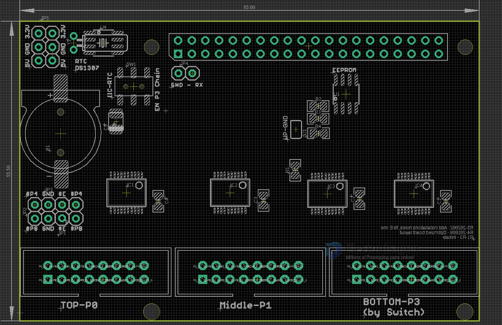

## hardware

https://www.electrodragon.com/product/rgb-matrix-panel-drive-board-raspberry-pi/

- legacy wiki page - https://w.electrodragon.com/w/RPI_RMP_Guide

- Pin Definitions, Product Series please refer to page - [[RMP-driver-dat]]

## Board Map 

Output Control Chains 
- TOP - P0
- Middle - P1
- Bottom - P3 (typo or P2 )

JP3 Power Supply Pins 
- 3.3V
- GND
- 5V

Switch SW1 
- Left to I2C RTC 
- right to use on board P3 chain output 

GND - RX
- ROW_E to GND
- or RX debug output 

JP1 / JP2 / JP3 
- ROW_E buffer select to 
  - pin 4 
  - or pin 8 
  - or gnd 

## Board Functions 

- [[RTC-dat]]: on board used battery is CR1220

- [[EEPROM-dat]]

## software 

- code: https://github.com/hzeller/rpi-rgb-led-matrix
- board: https://github.com/hzeller/rpi-rgb-led-matrix/tree/master/adapter

- [[rpi-dat]]

### C execute file 

clone project, build the binary executable file, and use following commands 

    make -C examples-api-use

### commandline test 

The panels of the same size could have different drive (scan) methods, it depends on the panel's driver chip. please try different led-multiplexing, from 0~17

    --led-multiplexing=0

## demo video 

- lately test 1 - https://www.youtube.com/watch?v=KG2e6GpXDIY&ab_channel=Electrodragon
- early test 1 - https://www.youtube.com/watch?v=wN-cqQ_2kNs&ab_channel=Electrodragon
- early test 2 - https://www.youtube.com/watch?v=LgrxaVafo5o&ab_channel=Electrodragon

telegram CH 
- https://t.me/electrodragon3/216
- https://t.me/electrodragon3/217

## common FAQ 

common errors 

- [[MPC1073-multiplexing-dat]] - [[MPC1073-test-log-dat]] 

- [[MPC1073-OS-error]] 

- [[MPC1073-design-error]] (obseleted, 2022 only)

### chip check

- probably NOT supported Panels: ICN2153 ICN2053 chips

- Check the chip type (FM6126A)

### more FAQs 

* Using all 3 chains with rPi 4, is there any GPIO free to use?  
No any free pins left except SC / SD pins 

* What are SC and SD pin holes? 
GPIO0 = SDA0, GPIO7 = SCL0

* What are RX pin hole? 
GPIO15, ROW_E pin, can be set to ground

### checklist 

Prerequisite Checklist, double check for GPIOs

turn off => SPI IIC, 1-wire, serial, etc in raspi-config

turn off => sound in /boot/config.txt -> add line dtparam=audio=off

optionally remove following modules: sudo apt-get remove bluez bluez-firmware pi-bluetooth triggerhappy pigpio

optionally disable: audio in kernel 

    cat <<EOF | sudo tee /etc/modprobe.d/blacklist-rgb-matrix.conf
    blacklist snd_bcm2835
    EOF

    sudo update-initramfs -u

by following up setup, the GPIO output should be all good

## ref 

- [[MPC1073-ref-dat]]

- https://w.electrodragon.com/w/RPI_RMP_Guide
- https://w.electrodragon.com/w/RPI_RMP_HDK

- [[ds1307-dat]] - [[hub75-dat]]

- backup demo code - https://github.com/btc520/RPI-MPC1073

- [[MPC1073]]

