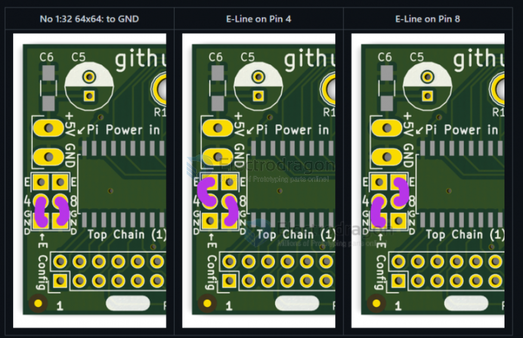

## hardware

https://www.electrodragon.com/product/rgb-matrix-panel-drive-board-raspberry-pi/

- legacy wiki page - https://w.electrodragon.com/w/RPI_RMP_Guide

- [[MPC1073-ref-dat]]

- pin definitions please refer to page - [[RMP-driver-dat]]

## Board Map 

Output Control Chains 
- TOP - P0
- Middle - P1
- Bottom - P3

JP3 Power Supply Pins 
- 3.3V
- GND
- 5V

Switch SW1 
- Left to I2C RTC 
- right to use on board P3 chain output 

GND - RX
- ROW_E to GND
- or RX debug output 

JP1 / JP2 / JP3 
- ROW_E buffer select to 
  - pin 4 
  - or pin 8 
  - or gnd 

## Board Functions 

- [[RTC-dat]]: on board used battery is CR1220

- [[EEPROM-dat]]

## software 

- code: https://github.com/hzeller/rpi-rgb-led-matrix/tree/master/adapter

## Product Series 

9-dat]] - [[RMP-driver-dat]]

## demo video 

- lately test 1 - https://www.youtube.com/watch?v=KG2e6GpXDIY&ab_channel=Electrodragon
- early test 1 - https://www.youtube.com/watch?v=wN-cqQ_2kNs&ab_channel=Electrodragon
- early test 2 - https://www.youtube.com/watch?v=LgrxaVafo5o&ab_channel=Electrodragon

telegram CH 
- https://t.me/electrodragon3/216
- https://t.me/electrodragon3/217

## common FAQ 

- [[MPC1073-OS-error]] - [[MPC1073-test-log-dat.md]]

- [[MPC1073-design-error]] (2022 only)

- probably NOT supported Panels: ICN2153 ICN2053 chips

- Check the chip type (FM6126A)

## ref 

- https://w.electrodragon.com/w/RPI_RMP_Guide
- https://w.electrodragon.com/w/RPI_RMP_HDK

- [[ds1307-dat]] - [[hub75-dat]]

- [[MPC1073]]

https://megaman.fandom.com/wiki/Neo_Arcadia