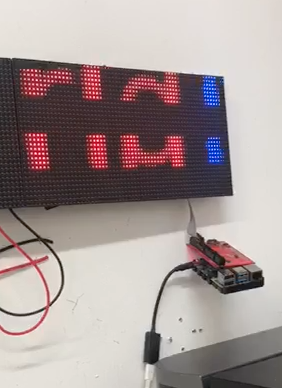
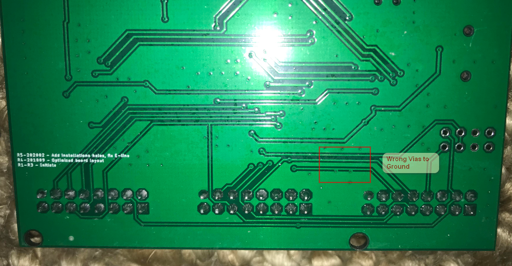
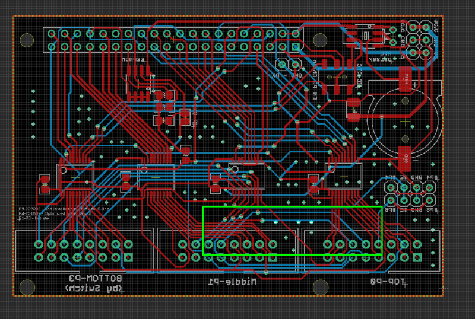
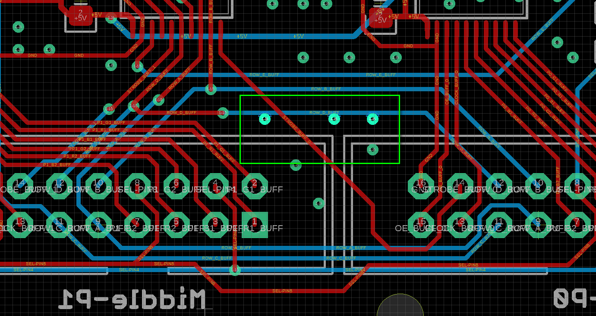
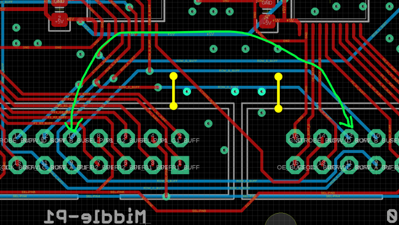
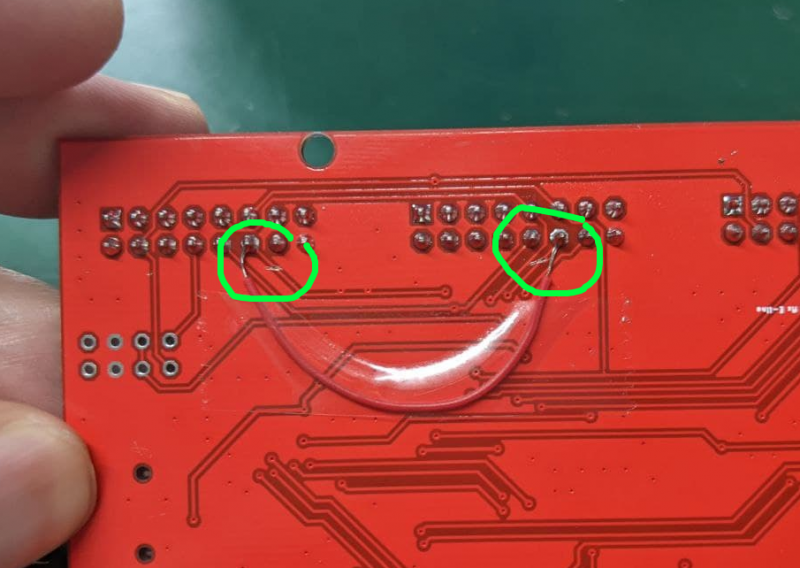

# MPC1073 error on February 2022

* For the problem, please see the [https://www.electrodragon.com/product/rgb-matrix-panel-drive-board-raspberry-pi/ product review] or [https://s5.electrodragon.com/wp-content/uploads/2017/08/Screen-Shot-2022-02-25-at-7.48.47-PM.png images here]

* We have about 200pcs problematic boards are sold in February 2022. 
* Very sorry for this problem, we could test this out because the problem only happen on a few kinds of panels.
* Please see the solution below, if you feel hard to apply this fix, please contact us by email info@electrodragon.com to get a replacement 
* We are currently selling the fiy-wire fixed version and new version in the same time, both working fine.
* Also see more comments and fix in the product review: https://www.electrodragon.com/product/rgb-matrix-panel-drive-board-raspberry-pi/

* Tools: please find correct tools to cut PCB, like this one [[PCB cutter]], you also need to solder a new wire instead

Blue mark: the wrong vias are on the trace, which cause the error
Green mark: cut the trace on the right green mark first, then add fly wire like this.

### Batch Design Error 

We have made a batch of board with the design error like below, please check:

Dear customer,

This board indeed has the design error, very sorry for this problem!

Please advise if we can provide you the new replacement or a refund, we will process as soon as we can. For the replacement option, if you have a new address please let me know instead. 

Thank you!

Best regards,

## How to Fix

MPC1073 RPI Matrix Drive Board, Error Overview

Error Zoom In

Apply the fix: cut off the two yellow lines, solder a fly-wire on green line

This is how it looks finally, we cut it on a different place, but works the same

* We made different version of the board based on different kinds of the footprint, because of the raising price of the chips. Otherwise we have to raise the price of this board dramatically. Thank you.

