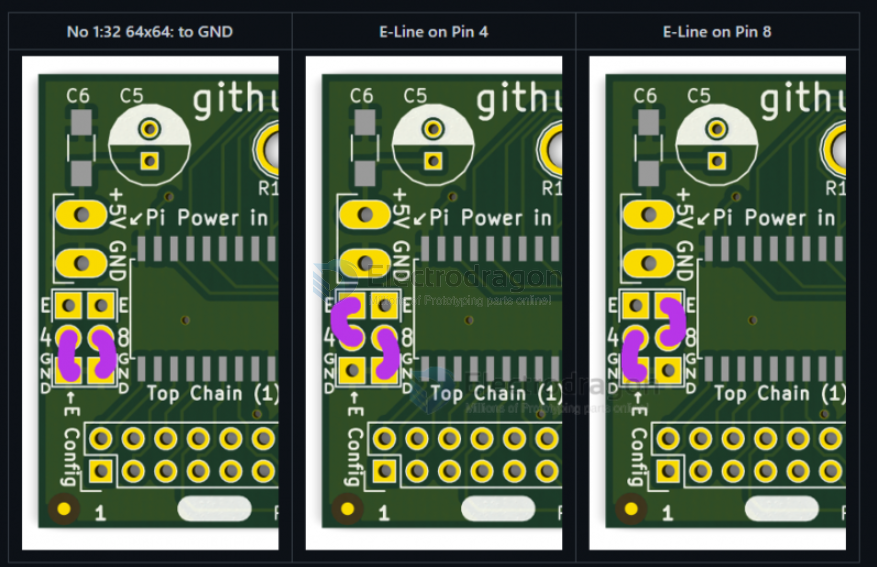

# MPC1073-multiplexing-dat

## when and how to setup the E-line == panel is oversize (64x64 is needed)

* E-Line buffer to either PIN4 or PIN8, refer to the image

| pin | mode 1 | mode 2 | mode 3 (set this) |
| --- | ------ | ------ | ----------------- |
| 4   | GND    | E      | GND               |
| 8   | GND    | GND    | E                 |

* Check if your panel is oversize (64x64 is needed) or chained with multiple panels, then you need to setup the E-line
* The normal setup is P4 + GND, and P8 + #E
* ~~how problem looks like - video here: https://fb.watch/c7KIaWjqIr/ (facebook dead)~~

## represent problem 

- read how to configure below at page [[MPC1073-test-log-dat]]

### on 64x32 panel: 

problem show up 

multiplexing fixed 

### on 64x64 panel: 

## further support 

If you still have problems, please try the default demo: 

    /rpi-rgb-led-matrix# ./examples-api-use/demo -D 0 --led-cols=64 --led-rows=32 --led-multiplexing=0 

And provide demo images to info@electrodragon.com to check.

- [[MPC1073-dat]]