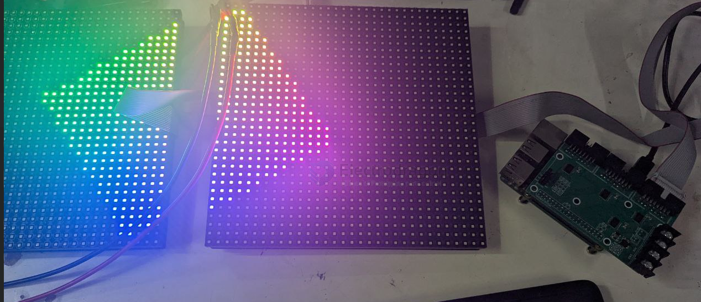

# MPC1073-test-log-dat.md

- all instructions here [[RMP-driver-dat]]

## Make first 

make it 

    make -C examples-api-use

## MPC1120 

### P4 == HJCLPCB-P4RGB-2121-06D = 64x64 

2x 64x64 panels, multiplexing=0

    ./examples-api-use/demo -D 0 --led-cols=64 --led-rows=64 --led-multiplexing=0 --led-chain=2 --led-slowdown-gpio=2

    ./examples-api-use/demo -D 0 --led-cols=64 --led-rows=64 --led-multiplexing=1 --led-chain=2 --led-slowdown-gpio=2

### P6-2727-8S-3232-S2 == 32x32 == outdoor 

2x 32x32 panels, multiplexing=1

    ./examples-api-use/demo -D 0 --led-cols=32 --led-rows=32 --led-multiplexing=1 --led-chain=2 --led-slowdown-gpio=2

CMD

    ./examples-api-use/demo -D 0 --led-cols=32 --led-rows=32 --led-multiplexing=1 --led-chain=2 --led-slowdown-gpio=2
    ./examples-api-use/demo -D 0 --led-cols=32 --led-rows=32 --led-multiplexing=2 --led-chain=2 --led-scan-mode=0
    ./examples-api-use/demo -D 0 --led-cols=32 --led-rows=32 --led-multiplexing=2 --led-chain=2

--led-no-hardware-pulse

    ./examples-api-use/demo -D 0 --led-cols=32 --led-rows=32 --led-multiplexing=2 --led-chain=2 --led-no-hardware-pulse

## P8 P10 Outdoor 32x16 == tested = OK

Run example for our selling 32x16 panel

## P10 - 32x16

    ./examples-api-use/demo -D 0 --led-cols=32 --led-rows=16 --led-multiplexing=8

    ./examples-api-use/demo -D 0 --led-cols=32 --led-rows=16 --led-multiplexing=3
    ./examples-api-use/runtext16.ppm -D 0 --led-cols=32 --led-rows=16 --led-multiplexing=8
    ./examples-api-use/demo -D 0 --led-cols=32 --led-rows=32 --led-multiplexing=1

To chain other panel:

    --led-chain=2 to --led-chain=4

Other example will have the same configuration

    --led-rows=8 --led-chain=2

## 32x32

multiplexing =1

    ./examples-api-use/demo -D 0 --led-cols=32 --led-rows=32 --led-multiplexing=1

## P4 64x32 == tested

Tested panel is 64x32 P4-256x128-2121-A1, multiplexing=0

    ./examples-api-use/demo -D 0 --led-cols=64 --led-rows=32 --led-multiplexing=0

## P3/P4 64x64 == tested

Extra Setup Needed
* Setup P4 jumper to ground, P8 jumper to #E line - [[MPC1073-multiplexing-dat]]

* multiplexing usually 0 or 1, try further options only when you have special board 
CMD for both P3/P4

commands 

    ./examples-api-use/demo -D 0 --led-cols=64 --led-rows=64 --led-multiplexing=1

## 128x128 / 256x128 == X

* Not tested yet, should be not supported

## more demos 

cmd 

    ./demo -D 1 runtext.ppm --led-no-hardware-pulse --led-slowdown-gpio=4 --led-cols=64 --led-rows=32

## panel info (obseleted part)

| Working Panel   | Panel Specification | Command                                |
| --------------- | ------------------- | -------------------------------------- |
| 32x16 P8 or P10 | 1/4                 | ./demo -D 0 --led-rows=8 --led-chain=2 |
| 32x32 P6        | 1/8                 |                                        |
| 64x32 P4        | 1/16                |                                        |
| 64x64 P4        | 1/32                |                                        |

## Sounds cards 

=== snd_bcm2835: found that the Pi sound module is loaded. ===
Don't use the built-in sound of the Pi together with this lib; it is known to be
incompatible and cause trouble and hangs (you can still use external USB sound adapters).

See Troubleshooting section in README how to disable the sound module.
You can also run with --led-no-hardware-pulse to avoid the incompatibility,
but you will have more flicker.
Exiting; fix the above first or use --led-no-hardware-pulse

    ./examples-api-use/demo -D 0 --led-cols=32 --led-rows=16 --led-multiplexing=8 --led-no-hardware-pulse

