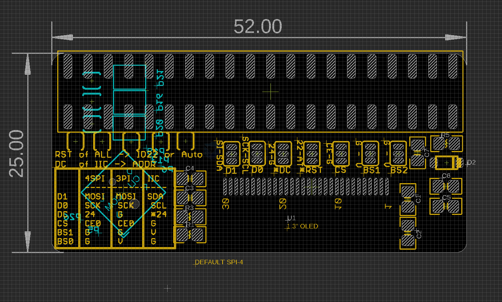

# MPC1090-dat

- [[OLED-dat]] == 1.3" RAW OLED 

https://www.electrodragon.com/product/1-3-oled-display-mini-shield-for-raspberry-pi/

- [legacy wiki page](https://www.electrodragon.com/w/Category:OLED#RPI_OLED)

- [[display-SDK-dat]]

## Board map 

| Button         | RPI IO Pins |
| -------------- | ----------- |
| push 1         | 16          |
| push 2         | 20          |
| push 3         | 21          |
| joystick_up    | 6           |
| joystick_down  | 26          |
| joystick_left  | 5           |
| joystick_right | 19          |
| joystick_press | 13          |

## quick guide 

* Please use default examples, python version 3, so >python3 demo.py
* Default setup is 4 Line SPI
* No need to soldering anythings if you want to quick start
* change modes please refer below

## setup 

| SSD1306 pin | Function                            | I2C          | SPI-3_Wire  | SPI-4_Wire  |
| ----------- | ----------------------------------- | ------------ | ----------- | ----------- |
| BS0         | Interface select 1                  | 0            | 1           | 0           |
| BS1         | Interface select 2                  | 1            | 0           | 0           |
| CS          | NC (ground) for I2C / SPI_CS        | 0            | CS: RPI_CE0 | CS: RPI_CE0 |
| DC          | ADDRESS / NC for / SPI_D/C Control  | ADDRESS: 0/1 | NC          | D/C Control |
| D0          | I2C_SCL / SPI_CLK                   | I2C_SCL      | SPI_CLK     | SPI_CLK     |
| D1          | I2C_SDA / SPI_MOSI                  | I2C_SDA      | SPI_MOSI    | SPI_MOSI    |
| RST         | Reset by RPI pin IO25 or auto_reset | -            | -           | -           |

## demo code 

- https://github.com/Edragon/RPI, In Display folder

## ref 

- [[RPI-SDK-dat]]

- [[MPC1090]] - [[MPC]]