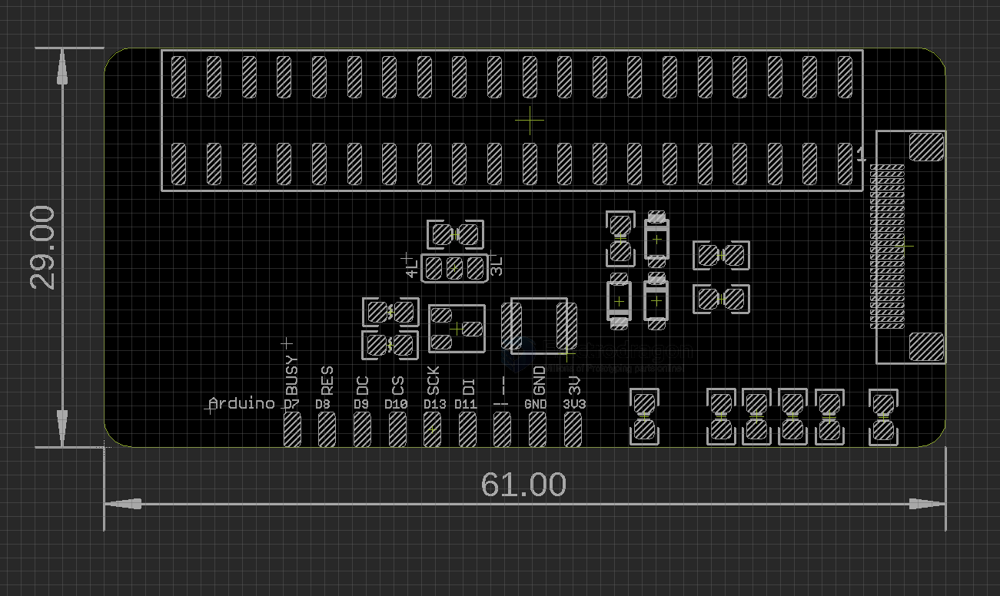

# MPC1091-dat

- [[c-dat]]

## Info

[product url - E-Paper, Epaper 2.13” Raspberry Pi Module R1-V3](https://www.electrodragon.com/product/e-paper-epaper-2-13-raspberry-pi-module/)

### Board Map, Dimension, Pins, chip info, Use Guide, Setup Jumper, etc.

- SPI selec: 4-line SPI, 3-line SPI 

## Applications, category, tags, etc. 

## Demo Code and Video

- [[e-paper-dat]] == V3

- enable [[SPI-dat]] by [[raspi-config-dat]]

## ref 

- [[e-paper-dat]] - [[Epaper]]

- [[RPI-dat]] - [[python-dat]]

- [[MPC1091]] 

- [legacy wiki page](https://www.electrodragon.com/w/E-paper)
