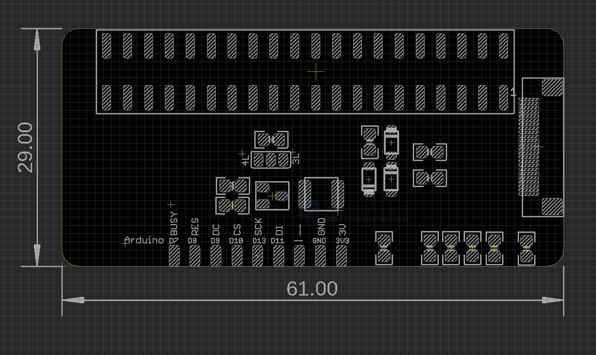

# MPC1091-dat

- [[c-dat]]

## Info

[product url - E-Paper, Epaper 2.13” Raspberry Pi Module R1-V3](https://www.electrodragon.com/product/e-paper-epaper-2-13-raspberry-pi-module/)

### Board Map, Dimension, Pins, chip info, Use Guide, Setup Jumper, etc.

- SPI selec: 4-line SPI, 3-line SPI 

## Applications, category, tags, etc. 

## Demo Code and Video

- [[epaper-dat]] == V3

- enable [[SPI-dat]] by [[raspi-config-dat]]

root@raspberrypi:/home/pi/213/2.13inch_e-Paper_HAT-code/raspberrypi/python# python main.py

root@raspberrypi:/home/pi/RPI-Display-main/2.13inch_e-Paper_HAT-code/raspberrypi/python# python epd2in13.py

python /home/pi/RPI-Display-main/2.13inch_e-Paper_HAT-code/raspberrypi/python/epd2in13.py

cd /home/pi/213/2.13inch-e-paper/SDK/V3/bcm2835_GDEH0213B72B

./epd

## ref 

- [[epaper-dat]] - [[Epaper]]

- [[RPI-dat]] - [[python-dat]]

- [[MPC1091]] 

- [legacy wiki page](https://www.electrodragon.com/w/E-paper)
