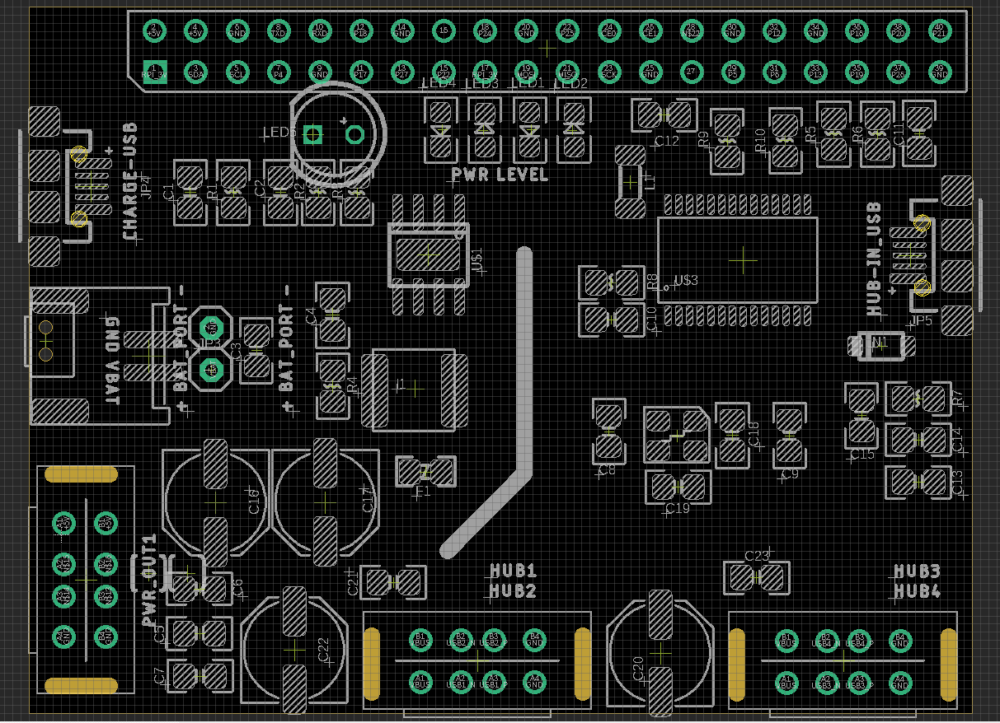

# MPC1095 DAT 

MicroUSB = Battery Charge In 

Power Out = External USB power Supply Only

HUB 1/2/3/4 = USB Hub, connecting with external USB devices 

Hub-in USB = to Rasbperry Pi USB Port

## Other Functions 

- LED flash light, active by pressing backside button SW2
- You may need to prepare a high watts LED to use this, because it is not a very common function for this board. 

## ref 

- [[MPC1095]]

