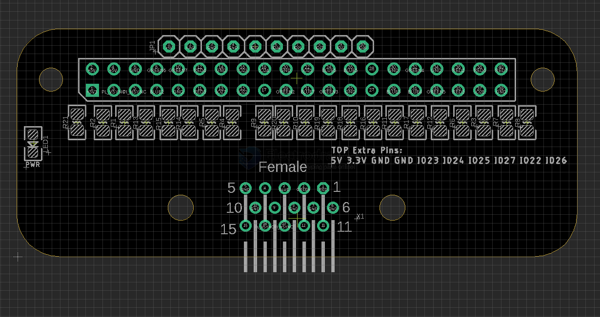

# MPC1105-dat

https://www.electrodragon.com/product/gpio-to-vga-convert-board-dpi-lcd-for-raspberry-pi/

legacy wiki page - https://w.electrodragon.com/w/RPI_Display

## Board maps 

RGB Pin assignment 

| pin | R   | G   | B   | res. setup |
| --- | --- | --- | --- | ---------- |
| 2   | 16  |     |     |            |
| 3   | 17  |     |     |            |
| 4   | 18  |     |     |            |
| 5   | 19  |     |     |            |
| 6   | 20  |     |     |            |
| 7   | 21  |     |     |            |

## ref 

- [[VGA-dat]] - [[DPI-dat]]

- [[MPC1105]]