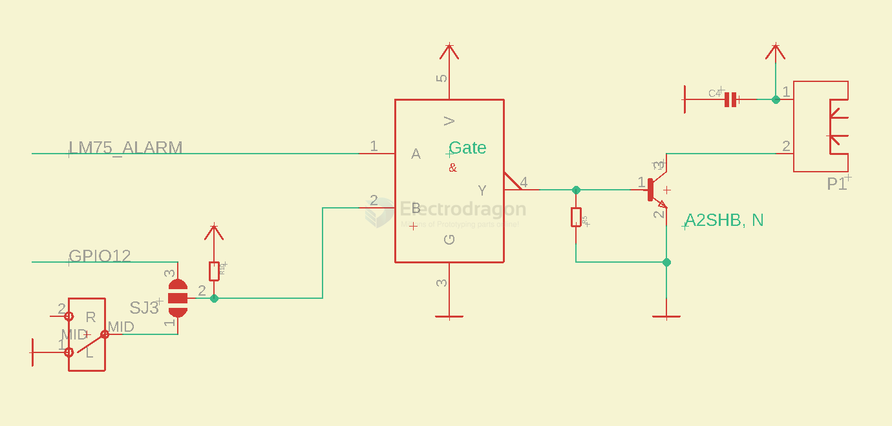

# MPC1108-dat

https://www.electrodragon.com/product/smart-fan-cooling-control-board-for-raspberry-pi/

## Function 

### Fan control by three options 

- NAND gate use [[logic-gate-dat]] 

- LM temperature Limit ALRAM (NAND_A)
- GPIO12 (NAND_B either gate ) - [[RPI-pin-dat]]
- Manual switch (NAND_B either gate )

| A   | B   | output mosfet | fan |
| --- | --- | ------------- | --- |
| L   | L   | H             | ON  |
| L   | H   | H             | ON  |
| H   | L   | H             | ON  |
| H   | H   | L             | OFF |

- [[Fan-dat]] drive by [[mosfet-dat]], only turn on or off

### Temperature sensor 

- [[LM75-dat]]

## Note 

Note when use this board and external 12V power supply to DC jack, you should NOT use micro USB power anymore, otherwise it can damage board.

## ref 

- [[RPI-SDK-dat]] - [[RPI-dat]]

- [[power-protection-dat]] - [[DFK-dat]]

- [[fan-dat]] == FAN 3007 

- [[dcdc-buck-dat]]

- [[LDO-dat]]

- [[MPC1108]]

