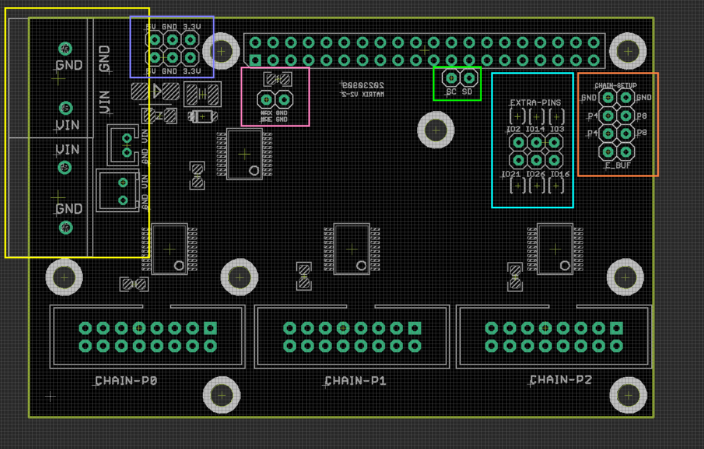
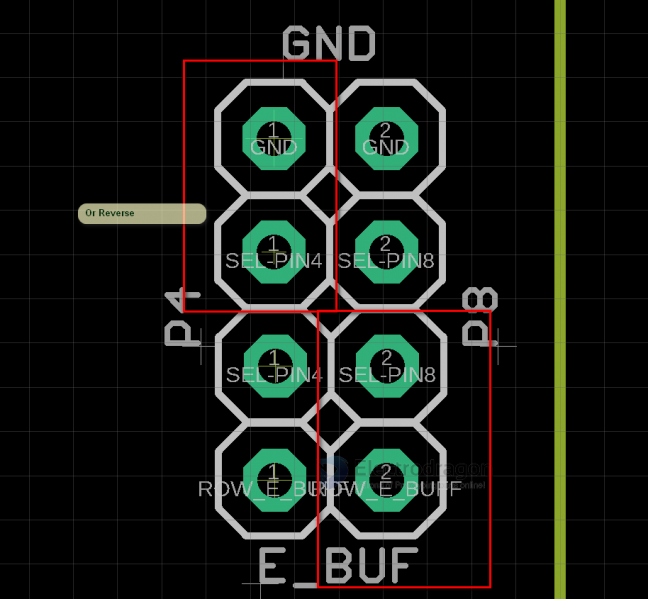
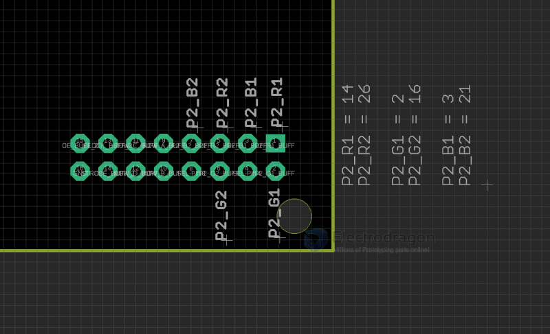
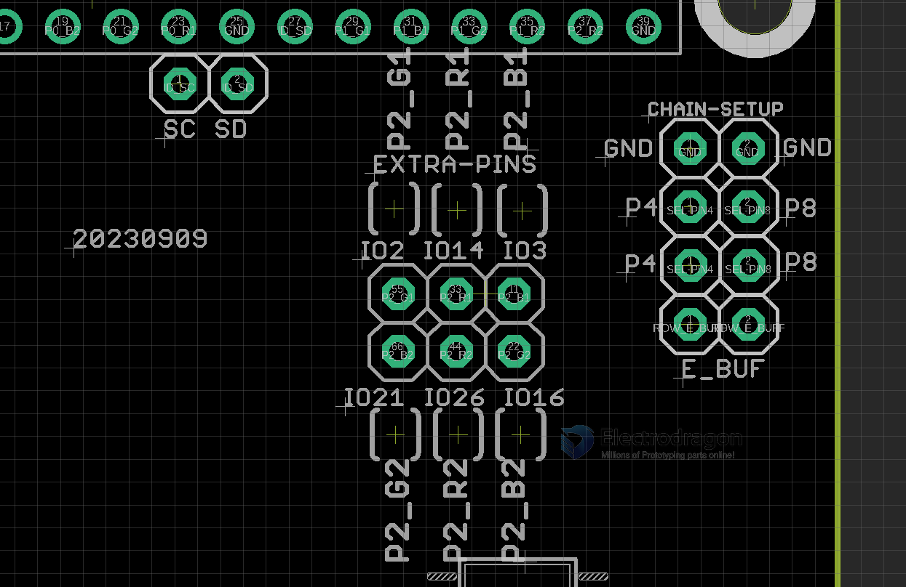

# MPC1119 DAT

First version please see here. [[MPC1073-dat]]

## Features of MPC1119

* Remove the right chip to free extra GPIOs of P2 chain, optionally
* bended-angle direction of the chain output
* Connect PIN4 or PIN8 to E_BUF for E-line
* Power input and output from the left large pin connectors, with power protection
* removed memory and RTC functions

## Board map and Pin Definitions overview 

- yellow box connector: all the same VIN/GND input, 8.5mm cable terminal, XH2.54mm and XH2.0mm connectors, all can be input or outout power, all connectors are before the board power protections  
- purple box connector: pin header connectors 5V/3.3V/GND, after the power protections. 
- pink box connector: ROW_E or GPIO15 to GND or RX | GND (Debug Port)
- green box connector: unused ID_SC ID_SD pins 
- light blue box connector: pin headers of Chain-P2, can be disconnect via jumpers 
- orange box connector: E-line setup to HUB75 pin8 or pin4

- pin definitions please refer to page - [[RMP-driver-dat]]

## Wiring

- If you supply power to matrix panels separately, the converter board MPC1119 will be power supplied by pins, no need extra power supply. 
- If you supply all power from one port on the converted board, you can connect the power supply to matrix panels from another port.
- Voltage should be no more than 5.5V.

## Extra Pins

- Please note there is a wrong typo on the board, IO12 should be IO14 
- top pins: IO2 IO12 IO3
- bottom pins: IO21 IO26 IO16

### Legacy Wiki 

- RMP Guide - https://w.electrodragon.com/w/RPI_RMP_Guide#P3/P4_64x64_(tested)

- [[MPC1073-DAT]] - [[MPC1119-DAT]]

## E-line Setup, Extra GPIOs Pin Definitions

Setup E-line, PIN4 to E, PIN8 to GND or vice vese.

P2 (Chain-3) 5V logic output pin definitions

P2 pins definitions, 3V3 direct lead out

## ref 

- [[MPC1119-faq-dat]]

- [[mpc1119]]