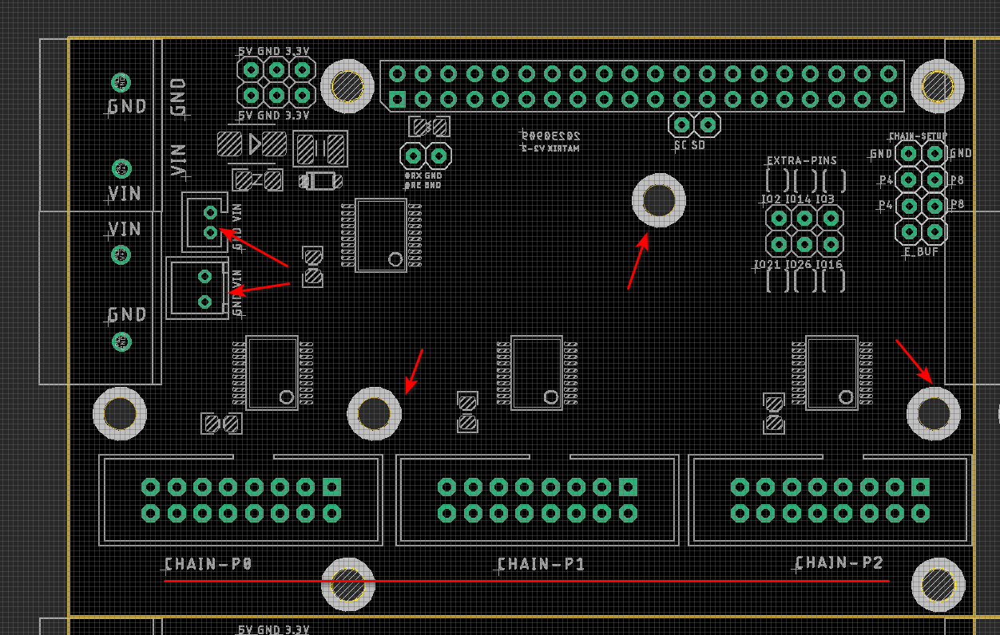
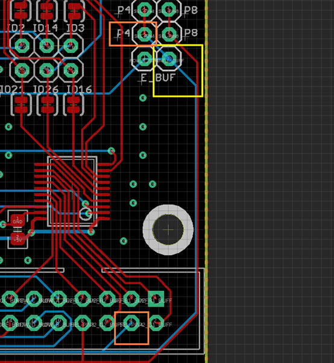
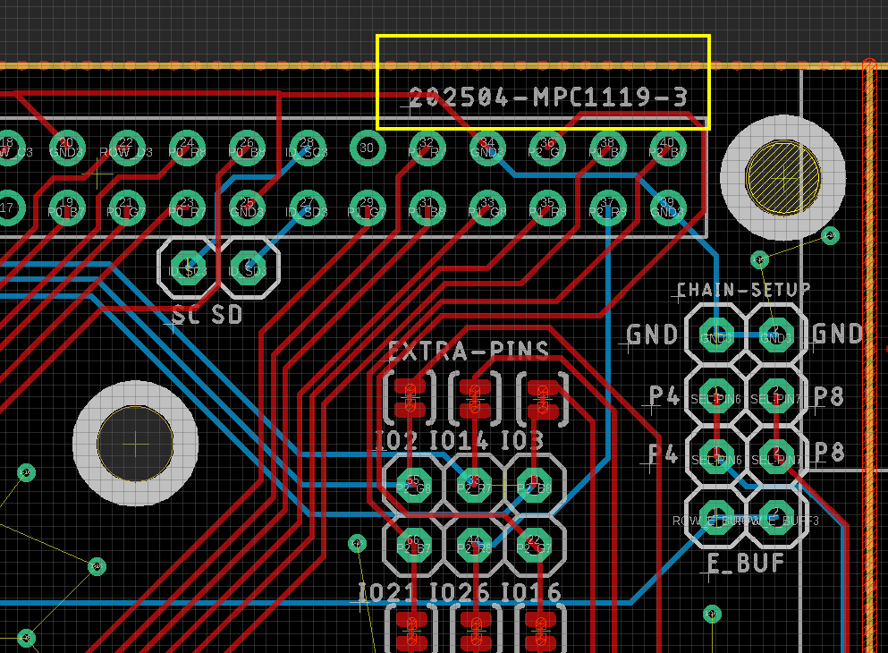

# MPC1119-error-dat.md

The new slighly updated board with following change also have a serious issue, please check the image below. The board with this issue is called "MPC1119-2-bad".

## The issue and quick fix: 

Please refer to the image above. There is an overlapping wire on the PCB (overlapped with the through-hole), highlighted in the **YELLOW** box.

To quickly fix this issue, please cut the **BLUE** wire on the back of the PCB and reconnect the pins indicated by the two **ORANGE** boxes.

**If you require a replacement, please just reply to the order email, and we will send you a new board.**

We sincerely apologize for this issue. This will be corrected in the next production batch, which will be released as a new version.

## The fix:

The fixed board will be called "MPC1119-3 (202504)" as marked on the **top right**, to fix this this issue. Website version will be named "MPC1119-3-fixed"

## ref 

[Problem analyzer can also see here.](https://rpi-rgb-led-matrix.discourse.group/t/new-electrodragon-board-version-with-e-line-problem/1062)

- [[MPC1119-dat]]