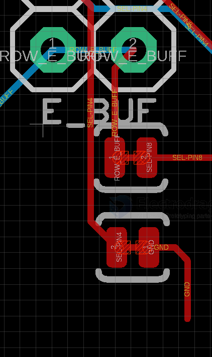

# MPC1120-dat

all instructions refer to [[RMP-driver-dat]] - [[RMP-driver-setup-dat]]

more test log please see here: - [[MPC1073-test-log-dat]]

most same information refer to page [[MPC1119-dat]]

- [[I2C-dat]] - [[RPI3-I2C0-dat.md]] - [[RPI-pin-dat]]

if you want to customized the connector to the bottom side, please see why does it not work here: [[HUB75-dat]]

## pin map 

| chain | R   | RPI_IO. | chain | G   | RPI_IO. | chain | B   | RPI_IO. |
| ----- | --- | ------- | ----- | --- | ------- | ----- | --- | ------- |
| P0    | R1  | 11      | P0    | G1  | 27      | P0    | B1  | 07      |
| P0    | R2  | 08      | P0    | G2  | 09      | P0    | B2  | 10      |
| P1    | R1  | 12      | P1    | G1  | 05      | P1    | B1  | 06      |
| P1    | R2  | 19      | P1    | G2  | 13      | P1    | B2  | 20      |
| P2    | R1  | 14      | P2    | G1  | 02      | P2    | B1  | 03      |
| P2    | R2  | 26      | P2    | G2  | 16      | P2    | B2  | 21      |

subtotal == 18 pins 

- STROBE = 4
- CLOCK = 17
- A = 22 
- B = 23 
- C = 24 
- D = 25 
- E = 15
- OE = 18 

subtotal == 8 pins

| usage | Physical Pin | GPIO Number | setup  |
| ----- | ------------ | ----------- | ------ |
| x     | 1            | 3.3V        |        |
| x     | 2            | 5V          |        |
|       | 3            | 2           | P2-G1  |
| x     | 4            | 5V          |        |
|       | 5            | 3           | P2-B1  |
| x     | 6            | GND         |        |
|       | 7            | 4           | StrobE |
|       | 8            | 14          | P2-R1  |
| x     | 9            | GND         |        |
|       | 10           | 15          | E      |
|       | 11           | 17          | CLK    |
|       | 12           | 18          | OE     |
|       | 13           | 27          | P0-G1  |
| x     | 14           | GND         |        |
|       | 15           | 22          | A      |
|       | 16           | 23          | B      |
| x     | 17           | 3.3V ???    |        |
|       | 18           | 24          | C      |
|       | 19           | 10          | P0-B2  |
| x     | 20           | GND         |        |
|       | 21           | 9           | P0-G2  |
|       | 22           | 25          | D      |
|       | 23           | 11          | P0-R1  |
|       | 24           | 8           | P0-R2  |
| x     | 25           | GND         |        |
|       | 26           | 7           | P0-B1  |
|       | 27           | ID_SD       |        |
|       | 28           | ID_SC       |        |
|       | 29           | 5           | P1-G1  |
| x     | 30           | GND         |        |
|       | 31           | 6           | P1-B1  |
|       | 32           | 12          | P1-R1  |
|       | 33           | 13          | P1-G2  |
| x     | 34           | GND         |        |
|       | 35           | 19          | P1-R2  |
|       | 36           | 16          | P2-G2  |
|       | 37           | 26          | P2-R2  |
|       | 38           | 20          | P1-B2  |
| x     | 39           | GND         |        |
|       | 40           | 21          | P2-B2  |

|        | setup  | GPIO     | Pin | usage | usage | Pin | GPIO  | setup |        |
| ------ | ------ | -------- | --- | ----- | ----- | --- | ----- | ----- | ------ |
|        |        | 3.3V     | 1   | x     | x     | 2   | 5V    |       |        |
| P2-1-G | P2-G1  | 2        | 3   |       | x     | 4   | 5V    |       |        |
| P2-1-B | P2-B1  | 3        | 5   |       | x     | 6   | GND   |       |        |
|        | StrobE | 4        | 7   |       |       | 8   | 14    | P2-R1 | P2-1-R |
|        |        | GND      | 9   | x     |       | 10  | 15    | E     |        |
|        | CLK    | 17       | 11  |       |       | 12  | 18    | OE    |        |
| P0-1-G | P0-G1  | 27       | 13  |       | x     | 14  | GND   |       |        |
|        | A      | 22       | 15  |       |       | 16  | 23    | B     |        |
|        |        | 3.3V ??? | 17  | x     |       | 18  | 24    | C     |        |
| P0-2-B | P0-B2  | 10       | 19  |       | x     | 20  | GND   |       |        |
| P0-2-G | P0-G2  | 9        | 21  |       | x     | 22  | 25    |       |        |
| P0-1-R | P0-R1  | 11       | 23  |       |       | 24  | 8     | P0-R2 | P0-2-R |
|        |        | GND      | 25  | x     |       | 26  | 7     | P0-B1 | P0-1-B |
|        |        | ID_SD    | 27  |       |       | 28  | ID_SC |       |        |
| P1-1-G | P1-G1  | 5        | 29  |       | x     | 30  | GND   |       |        |
| P1-1-B | P1-B1  | 6        | 31  |       |       | 32  | 12    | P1-R1 | P1-1-R |
| P1-2-G | P1-G2  | 13       | 33  |       | x     | 34  | GND   |       |        |
| P1-2-R | P1-R2  | 19       | 35  |       |       | 36  | 16    | P2-G2 | P2-2-G |
| P2-2-R | P2-R2  | 26       | 37  |       |       | 38  | 20    | P1-B2 | P1-2-B |
|        |        | GND      | 39  | x     |       | 40  | 21    | P2-B2 | P2-2-B |

## board update log 

# V1.2 

pre-connected SMD jumpers positioned under the PTH jumpers : 

- RPI buffered ROW-E  == pin8 (GND (E) )
- GND == pin4 (GND (SEL)) 
- refer to [[HUB75-dat]]

## ref 

- [[HUB75-dat]]

- [[RPI3-dat]]