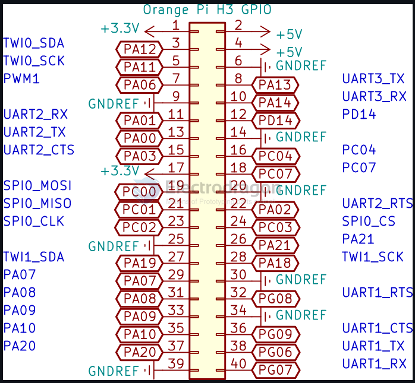

# OPI RGB LED Matrix Driver Board for Orange Pi PC

- https://www.electrodragon.com/product/rgb-led-matrix-panel-drive-board-for-orange-pi-opi-h3/

- relevant git - https://github.com/mrfaptastic/opi-allwinner-h3-rgb-led-matrix
- alternative git - https://github.com/Edragon/rpi-rgb-led-matrix-rockchip (opi-allwinner-h3-rgb-led-matrix)

- demo test - https://twitter.com/electro_phoenix/status/1522157916757041152

## Board Dimension

## Wiring UP 

    .output_enable = PA07
    .clock         = PA19
    .strobe        = PA14
					 
    .a             = PA00
    .b             = PA10
    .c             = PA03
    .d             = PA13
    .e             = PA20
					
    .p0_r1         = PA12
    .p0_g1         = PA08
    .p0_b1         = PA11
    .p0_r2         = PA06
    .p0_g2         = PA09
    .p0_b2         = PA01

## Only Orange PI PC / Allwiner H3 supported

This is an experimental library only.

A lightweight, non-GUI, distribution such as DietPi is recommended. Raspbian Lite is a bit easier to get started with and is a good second choice.

## demo video 

- https://t.me/electrodragon3/218

## Test Records

BTW: yesterday I tested the same pin connection and library with Orange Pi PC2 (Allwinner H5), and it works fine without problems

Orange Pi PC2 with Allwinner H5 Soc is much faster than Orange Pi PC with Allwinner H3 Soc

So, the same drive board can work with both Orange Pi boards