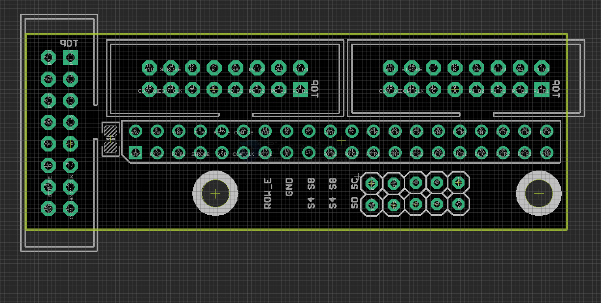
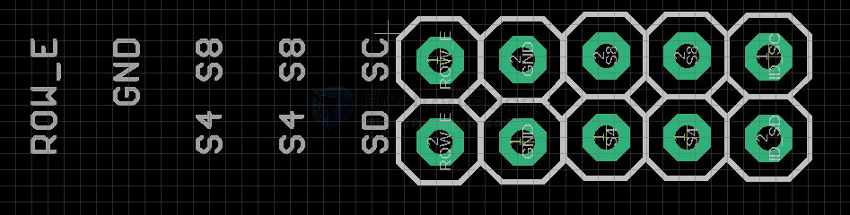

# MPC1130-dat

- board use guide please refer to page [[RMP-driver-dat]]

https://www.electrodragon.com/product/rpi-passive-3ch-rgb-matrix-drive-board-v0/

## Board map 

- reserved pull resistor for P18 IO1 (not soldered)

## Extra Pins 

- ROW_E GND Sel_8 Sel_8 SC
- ROW_E GND Sel_8 Sel_8 SC

## demo video 

- https://www.youtube.com/shorts/7zcytJmziE4

## ref 

- [[RPI3-dat]]

## update Logs 

Current version is V1 to quick start 

### further change

- default setup like this: 
    - 4   ROW-E --- 8  
    - So Row-e has a trace already connected to pin 8, and it will "just work" by default.
- clear instruction how to connect the board 
- added slik print to mark clearly of the orders of the connectors 
- have two pins on the board to easily attach 5 volts

