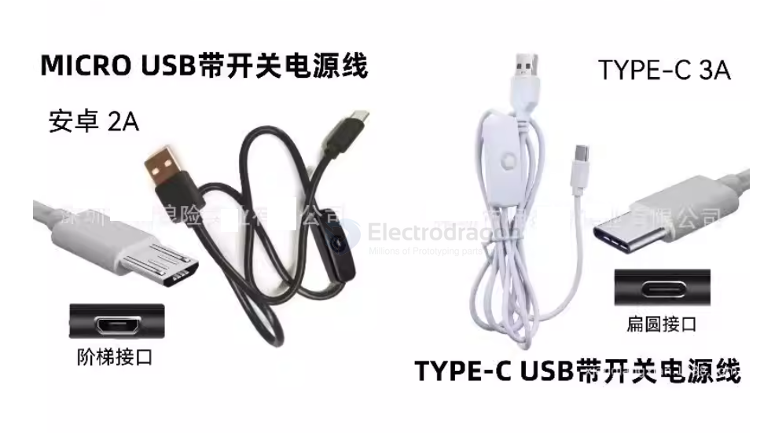
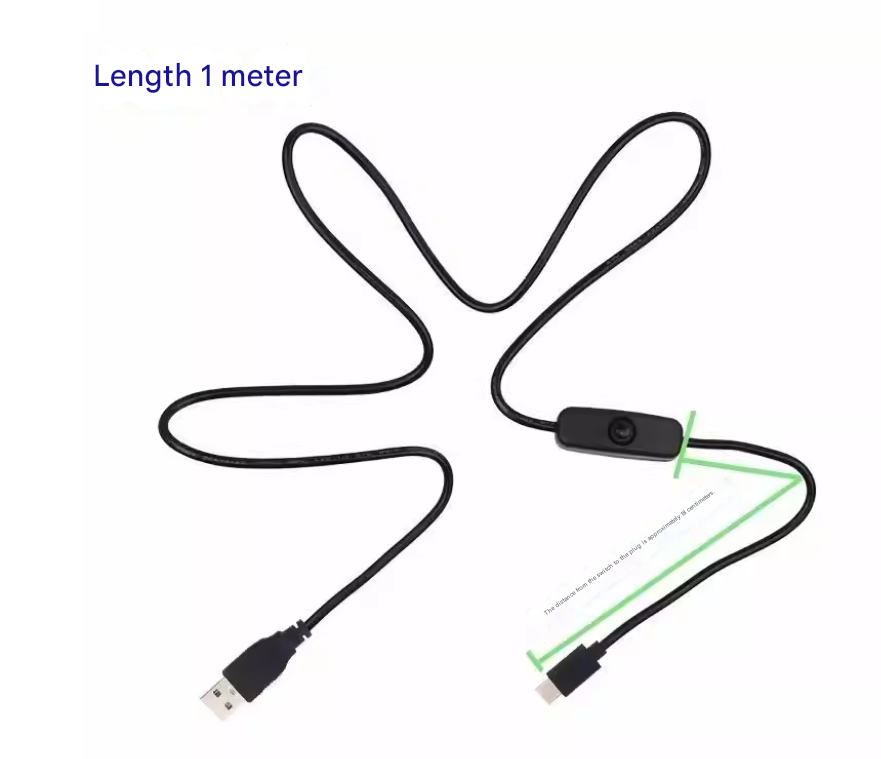

# MPCS050-dat

- [[cable-prototyping-dat]] - [[cable-USB-dat]] - [[MPCS050-dat]] - [[MPCS051-dat]]

## Info

[product url - USB Power cable w/Switch [Port]](https://www.electrodragon.com/product/micro-usb-power-cable-2a-for-raspberr-pi/)

version [[CONN-USB-micro-dat]] 

Versions:
- USB-A-Male — Micro USB, current   ~ up to 2A, length 1.5 meter
- USB-A-Male — Type-C USB, current ~ up to 3A, length 1.5 meter

### Board Map, Dimension, Pins, chip info, Use Guide, Setup Jumper, etc.

## Applications, category, tags, etc. 

## Demo Code and Video

## ref 

- [[MPCS050]] 

- legacy wiki page 

