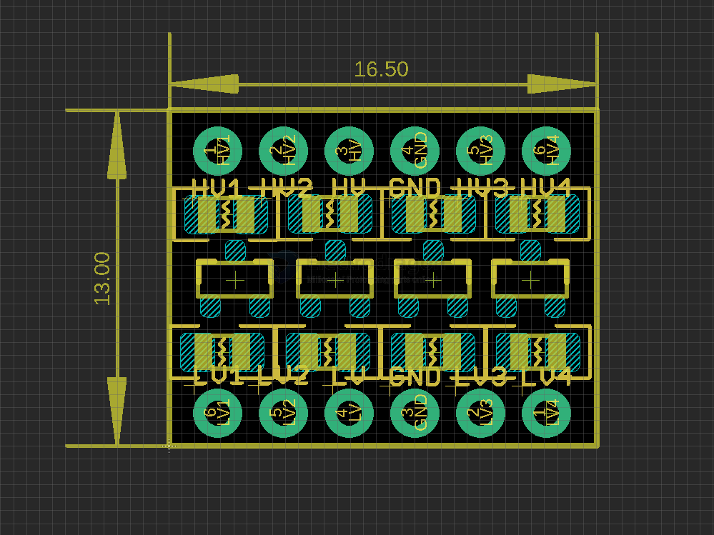

# MSP1007-dat

https://www.electrodragon.com/product/logic-level-converter-bi-directional-v2/

## board map 

## demo video 

- [Demo video convert Arduino UNO 5V TTL to 3v3 TTL for ILI9341 LCD.](https://www.youtube.com/watch?v=c2npSZgvVh4)

## ref 

- use-guide pdf - [[Logic_Level_Bidirectional.pdf]]

- [[BSS138-dat]] - [[logic-level-shifter-dat]]