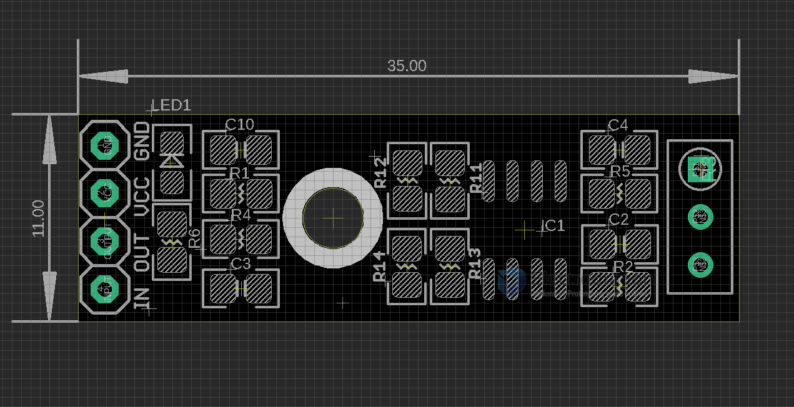

# MSP1023 dat 

amp for AC signal, but should also for DC signal 

amplification ratio = first 10x X second trimpot tune 10X = 100X

https://www.electrodragon.com/product/lm358-operational-amplifier-signal-amplifier-module-arduino-supported/

## Board Size 

## Legacy wiki page 
- https://w.electrodragon.com/w/LM358

## other ref 
- [[MSP1023]]