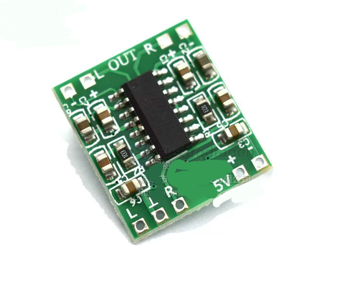
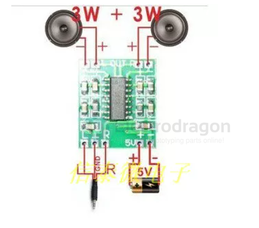
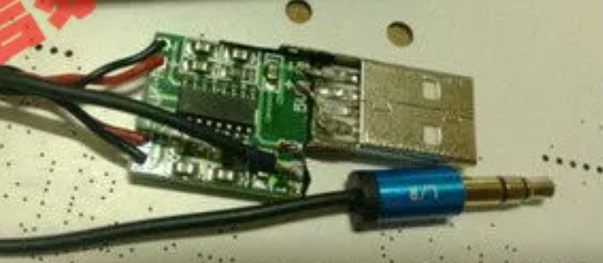

# MSP1025-dat 

[Product Page](https://www.electrodragon.com/product/ultra-miniature-digital-amplifier-board-23w-d-type/)

## Overview

Excellent noise suppression; no audible noise even with ears close to the speaker when no input is connected. Dual-channel 3W + 3W stereo output at 5V, capable of driving 4Ω or 8Ω speakers directly. The filterless Class D design allows for efficient power usage, even from a computer USB port. 

* **High sound quality** and sufficient power.
* **Double-sided PCB layout** ensures ground potential balance and minimizes crosstalk.
* **Ultra-miniature design** (21mm x 19mm) for easy integration into compact devices.
* **Machine-soldered** for higher quality and reliability compared to hand soldering.

## Specifications
* **Dimensions**: 21mm * 19mm
* **Power Input**: Recommended 5V (use a dedicated supply if possible).

## Usage Notes
> [!IMPORTANT]
> **Warning**: The negative terminals of the left and right output channels must **not** be connected together, as this will damage the IC. 
> 
> **Load First**: Always connect the speakers (load) before powering on the board.
> 
> This module is intended for DIY enthusiasts and experiments. If your application has very high performance requirements, please consider carefully.

## Wiring 

Connection to the [[speaker-dat]]:

## References 

- [[PAM8403-dat]]

- [[MSP1025]]

