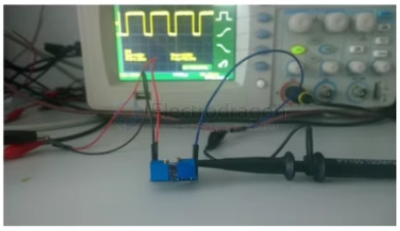

# MSP1046-dat

https://www.electrodragon.com/product/sg3525-pulse-width-modulator-breakout/

## Board map 

- left potentiometer = no int. input 
- right potentiometer = RT
- output = VC 

## Usage Guide 

As shown in the figure above, VCC/GND on the left is the power input terminal. 

- VCC is connected to DC7-40V positive voltage, and GND is grounded. OUT/GND on the right is the PWM signal output terminal. 
- OUT is the positive signal output terminal, and GND can be grounded. R5 is used to adjust the output duty cycle. R6 is the output frequency.

The red indicator light is on, indicating that the module power supply is working normally. 

Connect the OUT interface of this module to the positive pole of the oscilloscope signal input terminal, and GND to the negative pole of the oscilloscope signal input terminal. 

The effect is as shown in the figure:

### Adjusting the duty cycle and frequency

Among them, adjusting potentiometer R5 is to adjust the duty cycle, and adjusting potentiometer R6 is to adjust the frequency. The output frequency is adjusted to more than 700 Hz, as shown in the figure below:

### PWM drive

After adjusting the required frequency and duty cycle, directly connect OUT to the positive input of the circuit to be driven, and GND to the negative input of the driving circuit.

## ref 

- [[SG3525-dat]] - [[PWM-dat]] - [[LM7805-dat]]