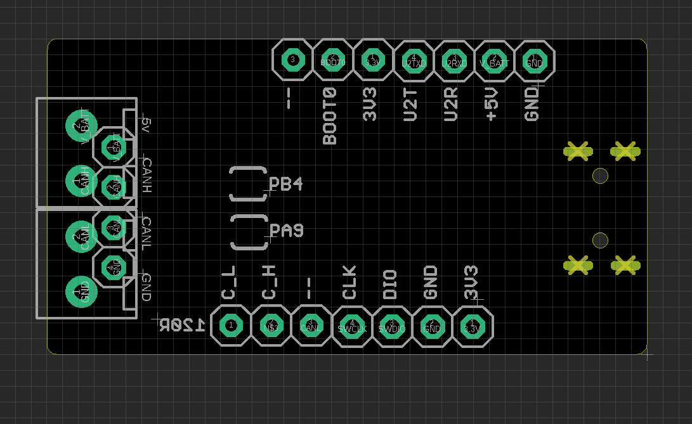

# MSP1061-DAT

## Features 

Support APPs or UART interface or Python script or ..
- socketCAN - linux 
- CANtact V0.3 
- [[Cangaroo-dat]] 
- slCAN
- python 

- [[canable-dat]]

## hardware 

## Default firmware = slCAN

- Please notice we flash UART interface fimware before 2023. April, and Canable firmware after 2023. April
- If you need upgrade to canable firmware, please try DFU update or flash chip with a .bin file
- On board LEDs blink on canable version, but not in UART (slCAN) version

- to use [[cangaroo-dat]], see the page

## demo 

- https://x.com/electro_phoenix/status/1651872392791093249

## ref 

- legacy reference - https://w.electrodragon.com/w/Category:CAN#CAN_USB
- https://canable.io/getting-started.html
- https://github.com/normaldotcom/canable-fw

- [[can-dat]] - [[stm32-dat]]

based on STM32F042C6T6 [[STM32F042-dat]]

- [[MSP1061]]