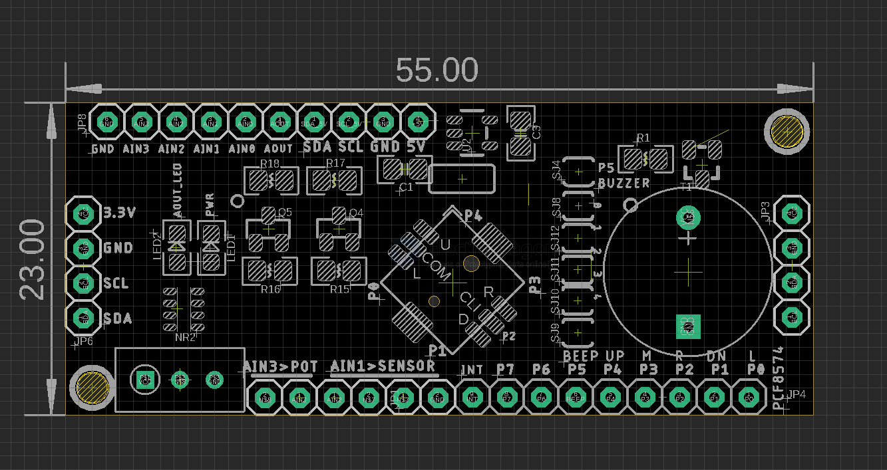

# MSP1064-dat

[legacy wiki page Schematic please see here.](https://www.electrodragon.com/w/IIC)

## tech 

- [[PCF8574-dat]] - [[IO-expander-dat]] - [[MCP23008-dat]] - [[I2C-dat]]

- [[PCF8591-dat]]

- [[buzzer-dat]] 

- [[joystick-dat]]

- [[trim-pot-dat]]

- [[ADC-dat]] - [[DAC-dat]]

- [[logic-level-shifter-dat]] - [[LDO-dat]]

## board info 

- JP8 [[PCF8591-dat]] - GND AIN3 AIN2 AIN1 AIN0 SDA_5V SCL_5V GND +5V 
- JP6 - SDA SCL GND VCC
- JP4 [[PCF8591-dat]] - TRIM_POT-> AIN3 / AIN2 < SENSOR 2x > GND / [[PCF8574-dat]] == INT P7 P6 P5 P4 P3 P2 P1 P0
- JP3 - SCL SDA GND VCC

cascadable design for JP6 and JP4 on left and right side. 

[[PCF8591-dat]] - AOUT == LED 

## demo code 

- https://github.com/Edragon/Arduino/tree/master/Sketchbook/11-Interface/PCF

## ref 

- [[GPIO-dat]]

- [[PCF8574-dat]] - [[PCF8591-dat]]