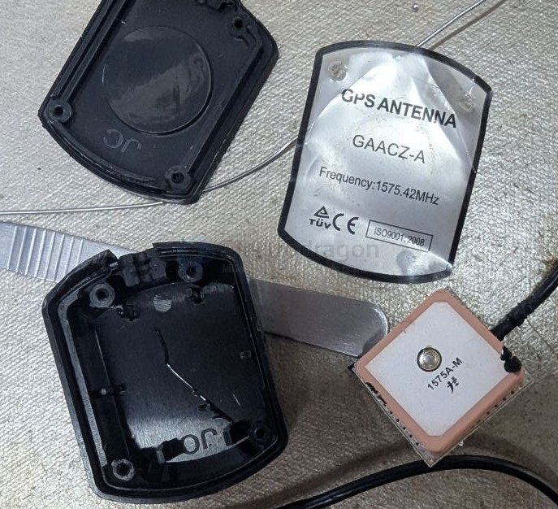

# NAN1001-dat

[GPS Magnetic Active External Antenna 3M 5Dbi](https://www.electrodragon.com/product/gps-magenatic-active-external-antenna-3m/)

- [[conn-SMA-dat]] 

## Board Map 

- 1575.42Mhz

GPS天线 规格 

陶瓷 

- 中心频率 1575±1MHz 
- 带宽 CF±8MHz 
- Polarization RHCP 
- 增益 5dBic（Zenith） 
- V.S.W.R ＜1.5
- 阻抗 50Ω 
- Axial Ratio 3dB（max） 
- Dimension 25*25*4mm 
  
放大器 

- 增益 28±2dB 
- 噪声系数 ＜1.0 
- Filter Insertion Loss ＜3dB 
- Ex-band Attenuation 35dB@CF±50MHz/50dB@CF±100MHz 
- 供电电压 **2.7-5V DC **
- Current Consumption 16mA V.S.W.R ＜2.0

Mechanical  

- 线材 RG174 96编 铜喷锡 
- 接头形式 SMA/MCX/FAKRA 等全系列 
- Radome Material PC 
- Mounting Method Magnet/Adhesive 

Environmental 

- 工作温度 -40℃~+85℃  
- Relative Humidity Up to 95% 
- 防水等级 IP65~IP67 
- Vibration 10 to 55Hz with 1.5mm amplitude 2hours 
- Environmentally Friendly ROHS 环保

## ref 

- [[antenna-location-dat]] - [[quectel-gps-dat]] - [[location-dat]]

- [[NAN1001]]

