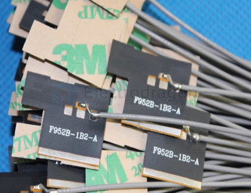

# NAN1010-dat

## Info

product url - [2PCs 2.4G Soft FPC PCB Antenna, IPX, ROHS](https://www.electrodragon.com/product/2-4g-soft-fpc-pcb-antenna-ipx-rohs/)

### Board Map, Dimension, Pins, etc.

- 2.4G WIFI small size black film antenna FPC soft PCB gain antenna 2.4G module antenna
- Length: 15CM IPX standard interface
- Wire impedance: 50 ohms
- Guaranteed round solder joints, no sharp edges, ROHS!

## Applications, category, tags, etc. 

- Suitable for all WIFI modules, Bluetooth and other wireless devices.

- [[RF-dat]] - [[WIFI-DAT]]

## Demo Code and Video

## ref 

- [[NAN1010]] 

- legacy wiki page 

