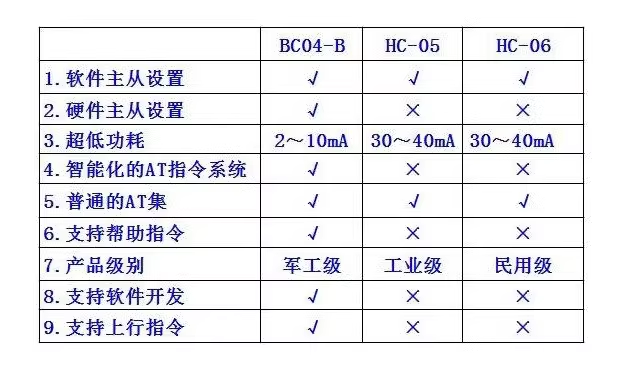

# NBL1018-dat 

https://www.electrodragon.com/product/30ft-3-3vdc-wireless-bluetooth-rf-transceiver-module-rs232-ttl/

## Features:

- BQB certificated
- Master / Slave Mode supported
- classic bluetooth easy to use

## Compare

| func                               | BC04—B         | HC—05            | HC—06          |
| ---------------------------------- | -------------- | ---------------- | -------------- |
| 1. Software master-slave setting   | ✔              | ✔                | ✔              |
| 2． Hardware master-slave settings | ✔              | X                | X              |
| 3． Ultra-low power consumption    | 2 ~ 10mA       | 30 ~ 40mA        | 30 ~ 40mA      |
| 4. Intelligent AT command system   | ✔              | X                | X              |
| 5． Normal AT set                  | ✔              | ✔                | ✔              |
| 6. Support help command            | ✔              | X                | X              |
| 7． Product Grade                  | Military Grade | Industrial Grade | Civilian Grade |
| 8． Support software development   | ✔              | X                | X              |
| 9. Support uplink command          | ✔              | X                | X              |

## Note 

- BC04 is better than HC05, HC06.
- Enter into serial UART mode (AT commands)  BEFORE paired.
- Before bluetooth connection established, it's supported by AT commands to set the baud rate, name, pairing password, parameters setting will save after power-down.  
- Automatically switches to transparent mode after the Bluetooth connection set.

## ref 

simialr modules - [[BC04-B-dat]] - [[HC05-dat]] - [[HC06-dat]] - [[NBL1012-dat]]

- [[BC04-B-dat]] - [[BC417-dat]]

- [[NBL1018]]