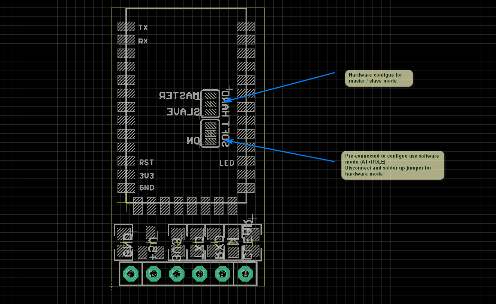
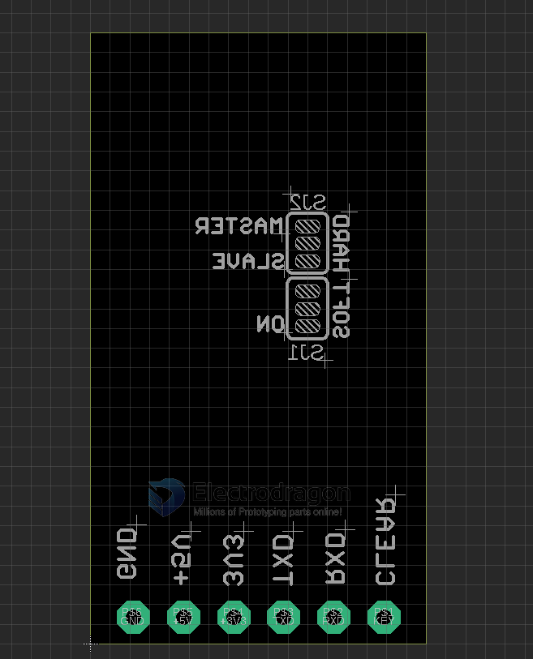
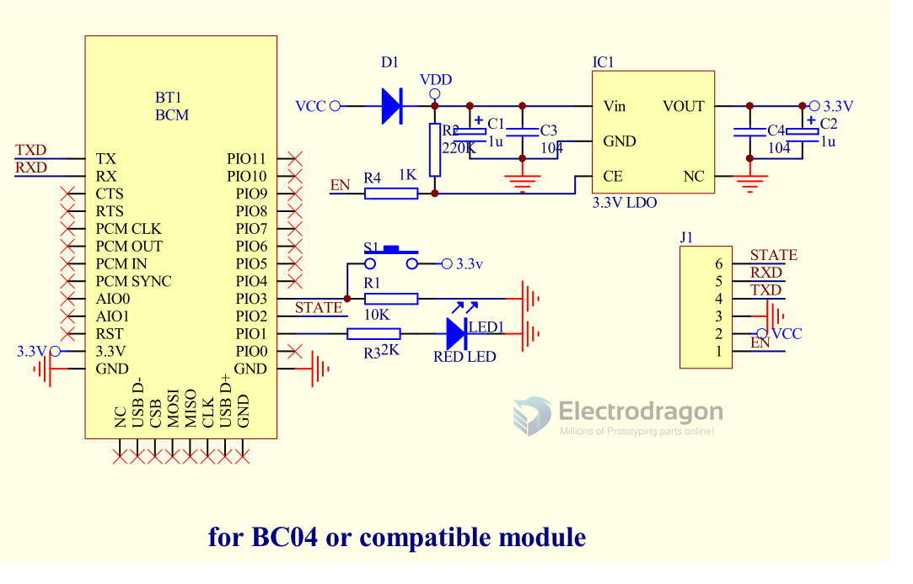

## NBL1057-0-dat

### Version Old 1

- R2 version add software and hardware master/slave mode select,
- default is software on.
- To use hardware select, need cut off connection on software ON with middle pin first.

### Backside Jumper Setup Mode:

Bottom jumper set hardware / software method for slave / master mode, Default setup for hardware method.

| Jumper | Function         | Mode                      | Default |
| ------ | ---------------- | ------------------------- | ------- |
| SJ2    | master / slave   | hardware control M/S mode |
| SJ1    | soft / hard Mode | control mode select       | Hard    |

- Top jumper set for slave / master mode.
- If you prefer to use software method by AT commands to change slave / mater mode, cut the bottom jumper connection (GND - middle pin), then re-connect to top by solder (VCC-middle pin).

### base version 

