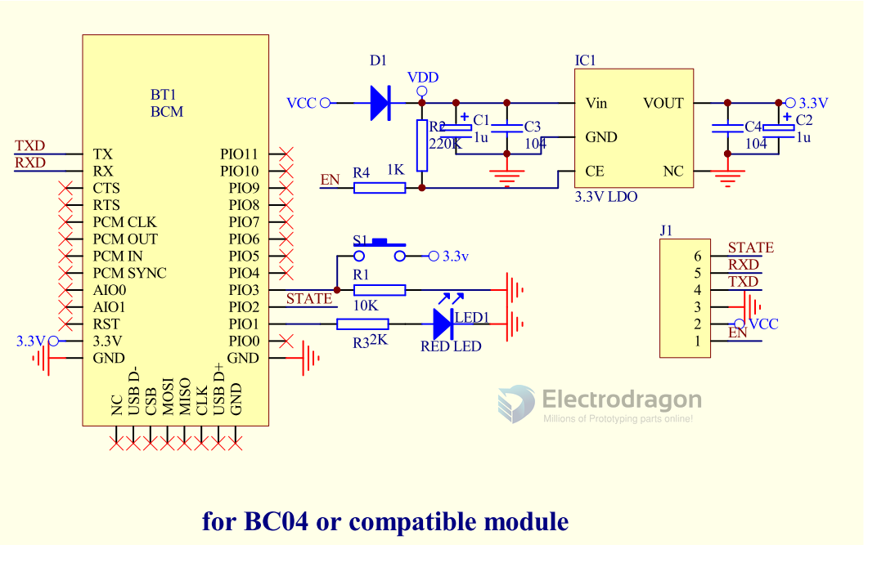

# NBL1057-dat

## Default Setup

- Default setup for BC-04B

And customize Setup

| Jumper | BC-04B                    | EC-04B                    | HC-05           | HC-06           |
| ------ | ------------------------- | ------------------------- | --------------- | --------------- |
| JP1    | BC                        | BC                        | HC              | HC              |
| JP2    | -                         | -                         | state or status * | state or status * |
| JP3    | BC                        | BC                        | HC              | HC              |
| JP4    | hardware Master or slave  | hardware Master or slave  | -               | -               |
| JP5    | hardware or software mode | hardware or software mode | -               | -               |

- state or status: pair state or AT commands status

## Base Board Pin Definitions

from left to right from front side

- GND
- +5V
- 3V3
- TXD
- RXD
- Clear - clear the pairing status

## Backside Jumper Setup Mode:

Bottom jumper set hardware / software method for slave / master mode, Default setup for hardware method.

| Jumper | Function         | Mode                      | Default |
| ------ | ---------------- | ------------------------- | ------- |
| SJ2    | master / slave   | hardware control M/S mode |
| SJ1    | soft / hard Mode | control mode select       | Hard    |

- Top jumper set for slave / master mode.
- If you prefer to use software method by AT commands to change slave / mater mode, cut the bottom jumper connection (GND - middle pin), then re-connect to top by solder (VCC-middle pin).

## SCH

### Version New 2

* add extra two functions pad pins 

### Version Old 1

- R2 version add software and hardware master/slave mode select,
- default is software on.
- To use hardware select, need cut off connection on software ON with middle pin first.

### base version 

## Wiring

- Board RXD -> target RXD, board TXD -> target TXD

## Mode

- Be aware default setting of the product is slave mode, communication only available between master and slave mode, but not master and master, or slave and slave mode.

## ref

- based on module - [[NBL1018-dat]] - [[NBL1022-dat]] - [[NBL1057-dat]]

- simialr modules - [[BC04-B-dat]] - [[HC05-dat]] - [[HC06-dat]] - [[NBL1012-dat]]
