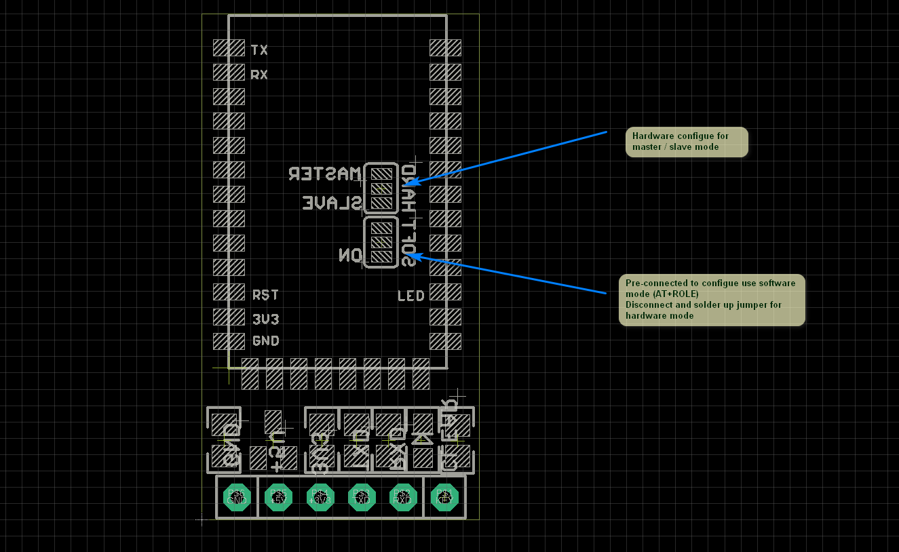

# NBL1057-dat

## Default Setup

- Default setup for BC-04B

And customize Setup

| Jumper | BC-04B                    | EC-04B                    | HC-05           | HC-06           |
| ------ | ------------------------- | ------------------------- | --------------- | --------------- |
| JP1    | BC                        | BC                        | HC              | HC              |
| JP2    | -                         | -                         | state or status * | state or status * |
| JP3    | BC                        | BC                        | HC              | HC              |
| JP4    | hardware Master or slave  | hardware Master or slave  | -               | -               |
| JP5    | hardware or software mode | hardware or software mode | -               | -               |

- state or status: pair state or AT commands status

## SCH

Version New 2

* add extra two functions pad pins 

Version Old 1

- R2 version add software and hardware master/slave mode select,
- default is software on.
- To use hardware select, need cut off connection on software ON with middle pin first.

## ref

- based on module - [[NBL1018-dat]] - [[NBL1022-dat]] - [[NBL1057-dat]]

- simialr modules - [[BC04-B-dat]] - [[HC05-dat]] - [[HC06-dat]] - [[NBL1012-dat]]
