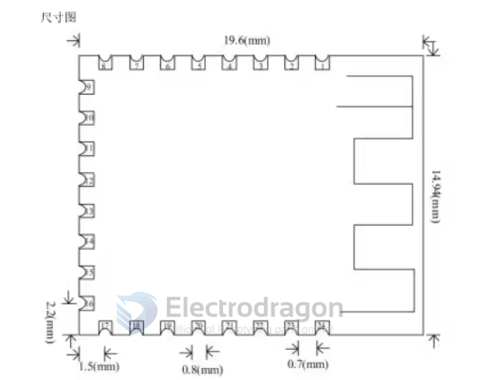
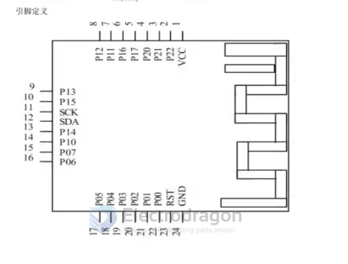
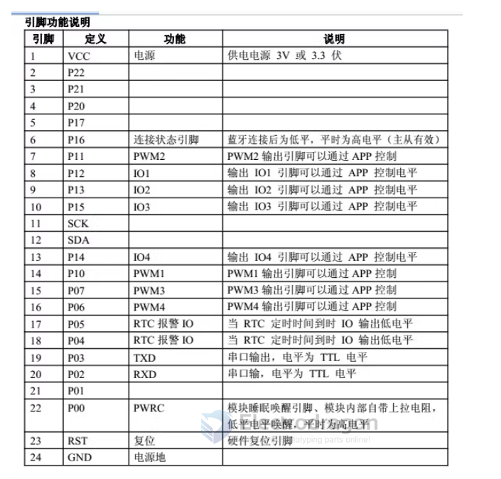

# NBL1060-dat 

- [[EY-08-dat]] - [[NBL1060-dat]]

legacy wiki page 
- https://w.electrodragon.com/w/EY-08_AT
- https://w.electrodragon.com/w/EY-08_Hardware
- https://w.electrodragon.com/w/JDY_Chips

## Dimension and Pins 

## Demo 

- https://www.youtube.com/watch?v=Kzks_3-z4E8

## Certificate 

The product has been certified
- FCC certification ID number: 2AM2YJDY-08 (USA)
- IC certification ID number: 23040-JDY08 (Australia)

## ref 

- [[NBL1061-dat]]

- [[CC2541-dat]]

- [[NBL1060]]