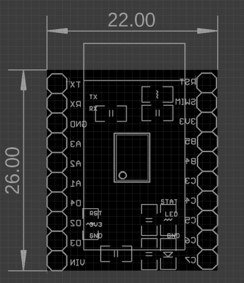
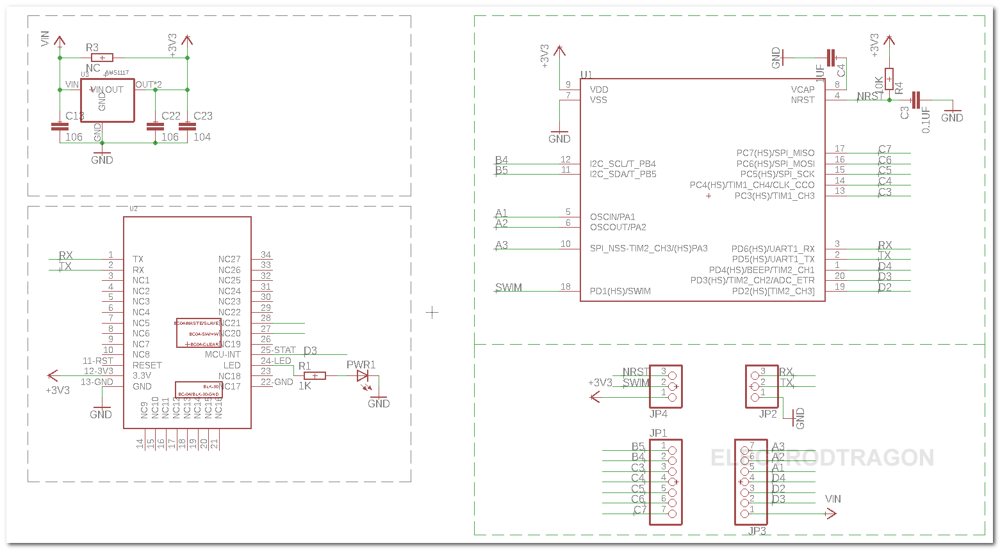

# NBL1064-dat

## Info

[product url - Bluetooth IO Control Board EDR 2.0, BLK_IO](https://www.electrodragon.com/product/bluetooth-io-control-board-edr-2-0-blk_io/)

### Board Map, Dimension, Pins, chip info, Use Guide, Setup Jumper, etc.

- [[BT-dual-mode-dat]] - [[bluetooth-dat]] - [[BT-SPP-dat]]

on board chip [[STM8-dat]] - [[MCU-dat]]

#### SCH 

## Applications, category, tags, etc. 

## Demo Code and Video

## ref 

- [[NBL1064]] 

- legacy wiki page 

https://www.electrodragon.com/w/Category:Bluetooth_2.0#AT_Commands

https://www.electrodragon.com/w/BLK_IO

